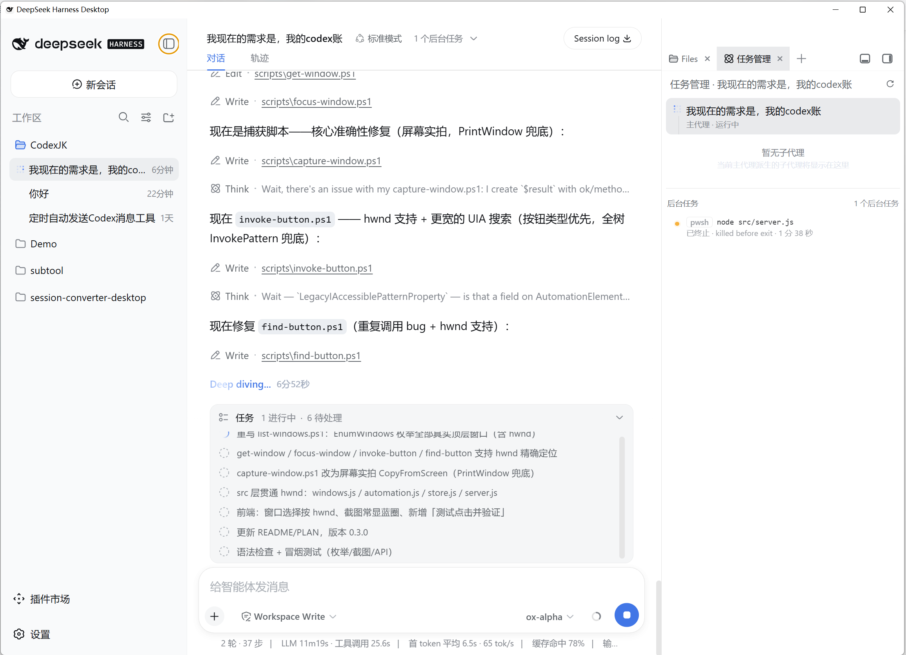
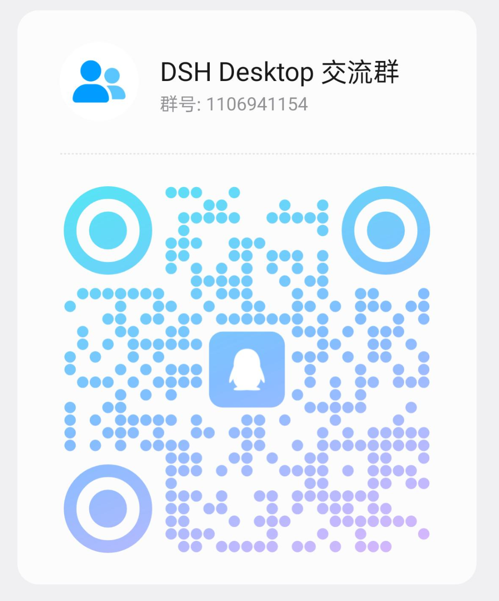

# DSH Desktop

A native desktop workbench for DeepSeek Harness. It brings Agent sessions, code, terminals, Git, subagents, and visual tools into one application that is ready to use locally.



## Download

Current Windows x64 release:

[Download DSH Desktop v1.0.4](https://github.com/rw0104/DSH-desktop/releases/tag/v1.0.4) · [Direct Windows installer](https://github.com/rw0104/DSH-desktop/releases/download/v1.0.4/DSH-Desktop-1.0.4-x64-Setup.exe)

The installer supports per-user installation, a custom install directory, Start Menu shortcuts, and a desktop shortcut. The current installer is unsigned, so Windows may show a SmartScreen or Unknown Publisher warning.

## Community

DSH Desktop QQ group: **1106941154**.



## Product capabilities

- **Desktop workbench**: Native Electron window, single-instance behavior, tray, startup feedback, and a managed DSH Profile.
- **Sessions and Agents**: DSH sessions, Agents, Tools, Credentials, and Profiles remain the core runtime experience.
- **Code workspace**: Explorer, editor, Git, browser, terminal, subagent, and background-task surfaces in one workbench.
- **Vision Toolkit**: Image Q&A, grounding, OCR, UI restoration, pixel diff, and asset extraction with an explicit first-run image-transfer notice.
- **Better Sidebar**: Right-side Explorer, editor, Git, browser, terminal, and task panels; collapsed for new users and expanded by explicit user action.
- **Native window feel**: Windows Mica, macOS vibrancy, persisted layout, and caption-control spacing on Windows.
- **Workspace selection**: Windows directory browsing lists only volumes that actually exist on the current machine and supports browsing from a drive root.
- **System language**: Chinese systems receive Chinese privacy and interface copy; other system locales use the corresponding English copy.

## What DSH Desktop adds to DeepSeek Harness

DSH Desktop uses the official [DeepSeek Harness](https://github.com/deepseek-ai/deepseek-harness) as its Agent and Web Runtime and adds a desktop product layer without modifying the official DSH source:

- Electron desktop shell, tray, window lifecycle, and installer/update handoff;
- Windows Mica/macOS vibrancy Advanced Shell with the official left sidebar and Better Sidebar right workbench composed together;
- Pinned product integration for Vision Toolkit `0.1.24` and Better Sidebar `0.13.1`;
- Vision privacy consent, Python/Chrome health checks, and visible startup failure handling;
- Profile management, a managed terminal, Windows directory-picker enhancements, and package/memory release gates;
- Windows x64 NSIS packaging and GitHub Release automation.

The official Runtime remains responsible for Agents, Sessions, Tools, Profiles, Credentials, and the Web Runtime. DSH Desktop owns the desktop shell, workbench experience, and product plugin composition.

## Install and first launch

1. Download the Windows x64 installer from the [v1.0.4 Release](https://github.com/rw0104/DSH-desktop/releases/tag/v1.0.4).
2. Choose an installation directory and complete setup.
3. Launch DSH Desktop. The first launch explains the Vision Toolkit privacy boundary; Chinese Windows displays the Chinese copy.
4. Configure models, credentials, and the vision service in DSH Settings. Python is required for local Vision tools; Chrome, Chromium, or Edge is only required for HTML screenshots.

The installer includes the DSH Runtime, Vision Toolkit, and Better Sidebar. Customers do not need a separate Node.js installation just to launch the desktop application.

## Run from source

Source development requires Node.js 22.19+ or 24.x and Corepack:

```powershell
git clone https://github.com/rw0104/DSH-desktop.git
cd DSH-desktop
git submodule update --init --recursive
corepack yarn install --immutable
corepack yarn dev
```

`deepseek-harness/` is a pinned upstream Git submodule. The desktop product implementation and packaging configuration live in this repository.

## License

This project is licensed under the MIT License. Redistributions must preserve the license and copyright notices for DeepSeek Harness, Vision Toolkit, Better Sidebar, and transitive dependencies. DeepSeek, DeepSeek Harness, and related marks belong to their respective owners; this project does not imply official endorsement or a commercial partnership.
