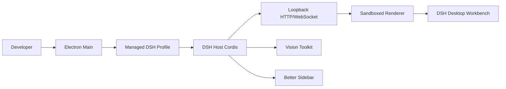

# DSH Desktop

A desktop development workbench for DeepSeek Harness, combining local Agent sessions, visual tools, and a code workspace.

This repository contains the `rw0104/DSH-desktop` product implementation. The desktop shell continues from the open-source DSH Desktop v2 Electron/DSH composition boundary, while the official DSH runtime remains a pinned Git submodule.

## Current status

The project is under active development. It currently includes:

- Electron 43.4.0 shell with single-instance behavior, tray, Profile lifecycle, and a loopback Web carrier;
- DSH `0.1.0-rc.6` runtime;
- Vision Toolkit `0.1.24` and Better Sidebar `0.12.3` as the default Profile combination;
- Advanced Shell Sidebar/Details controls with persisted layout preferences;
- Vision image-transfer consent and Python/Chrome runtime checks;
- Electron BrowserWindow CDP screenshot regression and Windows x64 unpacked packaging gates.

Release work still pending:

- macOS arm64/x64 signing, notarization, and universal DMG;
- Windows Authenticode, clean-machine install, upgrade, uninstall, and SmartScreen validation;
- fully offline visual understanding;
- Pi as a replacement for the DSH runtime.

## Product boundary

| Layer | Source | Responsibility |
| --- | --- | --- |
| DSH runtime | [deepseek-ai/deepseek-harness](https://github.com/deepseek-ai/deepseek-harness) | Agent, Session, Tool, Profile, Credential, and Web runtime |
| Desktop shell baseline | [anywhere-labs/deepseek-harness-desktop](https://github.com/anywhere-labs/deepseek-harness-desktop) | Open-source Electron Host, Profile, plugin Loader, and packaging boundary |
| This product | [rw0104/DSH-desktop](https://github.com/rw0104/DSH-desktop) | Workbench experience, plugin composition, privacy flow, health checks, and release gates |
| Product plugins | Community plugins | Pinned Vision Toolkit and Better Sidebar integration |

`deepseek-harness/` is a pinned, read-only Git submodule. Desktop features do not modify the official DSH source.

## Architecture



Electron Main owns windows, tray, profiles, updates, and managed processes. The DSH Host owns Agent and plugin lifecycle. The Renderer only uses the same-origin Web carrier and receives no raw Electron API.

## Getting started

### Development environment

Requirements:

- Windows x64 or macOS;
- Node.js 22.19+ or 24.x;
- Corepack;
- Python 3.11+ for Vision local tools;
- Chrome, Chromium, or Edge for `vision_html_screenshot`.

```powershell
git clone https://github.com/rw0104/DSH-desktop.git
cd DSH-desktop
git submodule update --init --recursive
corepack yarn install --immutable
corepack yarn workspace dsh-plugin-desktop typecheck
```

Start the desktop development build:

```powershell
corepack yarn dev
```

### Verify the environment

```powershell
corepack yarn workspace dsh-plugin-desktop verify:release-readiness
corepack yarn workspace dsh-plugin-desktop verify:vision-runtime
```

## Product plugins

### Vision Toolkit

Vision Toolkit gives text-only models image Q&A, grounding, OCR, UI restoration, pixel diff, and asset extraction capabilities.

Packaged launches explain the image-transfer boundary. Image-understanding requests may be sent to the configured vision service; crop, pixel diff, color analysis, and SVG tracing can run locally. Users can replace the vision endpoint and credentials in DSH Settings.

### Better Sidebar

Better Sidebar provides Explorer, CodeMirror editing, Git, browser, terminal, subagent, and background-task workspaces. It is loaded as a DSH Profile plugin, not copied into the Electron Renderer and not implemented by modifying official DSH source.

## Tests and evidence

- [Feasibility analysis](docs/01-feasibility-analysis.md)
- [Development plan](docs/02-development-plan.md)
- [Development log](docs/03-development-log.md)
- [Electron screenshot evidence](docs/evidence/electron/README.md)
- [Vision runtime report](docs/evidence/vision-runtime/windows.json)
- [Windows unpacked artifact report](docs/evidence/release/windows-dir.json)

## License and trademarks

This project is licensed under the MIT License. Upstream DSH Desktop, DeepSeek Harness, Vision Toolkit, Better Sidebar, and transitive dependency notices must be preserved when redistributing the application.

DeepSeek, DeepSeek Harness, and related marks belong to their respective owners. This project does not imply official endorsement or commercial partnership.
