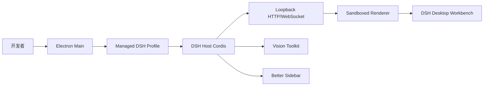

# DSH Desktop

面向 DeepSeek Harness 的独立桌面开发工作台，提供本地 Agent、会话、视觉工具和代码工作区。


首发版本 `1.0.0`，面向需要在本地处理会话、代码、终端、Git、子代理和视觉任务的开发者。

## 当前状态

当前首发版本已经具备：

- Electron 43.4.0 桌面壳、单实例、托盘、Profile 生命周期和 loopback Web carrier；
- DSH `0.1.0-rc.6` Runtime；
- Vision Toolkit `0.1.24` 和 Better Sidebar `0.12.3` 默认 Profile 组合；
- Advanced Shell 的原生窗口框架和布局持久化；
- Vision 图片外发同意、Python/Chrome 健康检查；
- Electron BrowserWindow CDP 截图回归和 Windows x64 unpacked packaging 门禁。

尚未完成的发布项：

- macOS arm64/x64 签名、公证和 universal DMG；
- Windows Authenticode、干净机器安装、升级、卸载和 SmartScreen 验证；
- 完全离线的视觉理解；
- Pi 作为 DSH 核心运行时。

## 基于 DSH Runtime 的新增功能

官方 [DeepSeek Harness](https://github.com/deepseek-ai/deepseek-harness) 提供 Agent、Session、Tool、Profile、Credential 和 Web Runtime。本项目在不修改官方 DSH 源码的前提下，增加了完整的桌面产品层：

- Electron 原生桌面壳：单实例、系统托盘、原生窗口、更新交接和受管终端；
- Advanced Shell：Windows Mica/macOS vibrancy 原生窗口框架，官方左侧栏与 Better Sidebar 右侧面板保持各自原有位置；
- 默认产品插件组合：Vision Toolkit `0.1.24` 与 Better Sidebar `0.12.3`；
- Vision 隐私同意流程：首次启动明确图片外发边界，中文系统显示中文提示；
- Vision 运行时健康检查：Python `3.11+` 探测、Chrome/Chromium/Edge 探测和 HTML 截图前置检查；
- Profile 与发布工程：插件去重、用户停用、runtime closure、真实 Electron 截图、Windows 安装器和内存/体积预算门禁；
- Windows x64 安装包：NSIS 安装、桌面/开始菜单快捷方式和升级交接。

这些是 DSH Desktop 的产品实现，不是官方 DSH Runtime 的替代品，也不要求把 Pi 放进首发核心运行时。

## 产品边界

| 层 | 来源 | 责任 |
| --- | --- | --- |
| DSH Runtime | [deepseek-ai/deepseek-harness](https://github.com/deepseek-ai/deepseek-harness) | Agent、Session、Tool、Profile、Credential 和 Web Runtime |
| 本项目 | [rw0104/DSH-desktop](https://github.com/rw0104/DSH-desktop) | 独立 Electron 桌面产品、工作区体验、插件组合、隐私流程、健康检查和发布门禁 |
| 产品插件 | 社区插件 | Vision Toolkit 和 Better Sidebar 的固定版本组合 |

`deepseek-harness/` 是固定 commit 的只读 Git 子模块，桌面功能不修改官方 DSH 源码。桌面产品代码、打包配置和新增功能均维护在本仓库。

## 架构



Electron Main 负责窗口、托盘、Profile、更新和受管进程。DSH Host 负责 Agent 和插件生命周期。Renderer 只访问同源 Web carrier，不接收原始 Electron API。

## 快速开始

### 开发环境

要求：

- Windows x64 或 macOS；
- Node.js 22.19+ 或 24.x；
- Corepack；
- Python 3.11+，Vision 本地工具需要；
- Chrome、Chromium 或 Edge，`vision_html_screenshot` 需要。

```powershell
git clone https://github.com/rw0104/DSH-desktop.git
cd DSH-desktop
git submodule update --init --recursive
corepack yarn install --immutable
corepack yarn workspace dsh-plugin-desktop typecheck
```

启动桌面开发版：

```powershell
corepack yarn dev
```

### 验证开发环境

```powershell
corepack yarn workspace dsh-plugin-desktop verify:release-readiness
corepack yarn workspace dsh-plugin-desktop verify:vision-runtime
```

## 产品插件

### Vision Toolkit

Vision Toolkit 为纯文本模型提供图片问答、Grounding、OCR、UI 还原、像素差异和素材提取。

打包应用首次启动会说明图片外发边界。图片理解请求可能发送到配置的视觉服务；裁剪、像素差异、颜色分析和 SVG 描摹可以在本地运行。用户可以在 DSH Settings 中替换视觉 Endpoint 和凭据。

### Better Sidebar

Better Sidebar 提供 Explorer、CodeMirror 编辑器、Git、浏览器、终端、子代理和后台任务工作区。它作为 DSH Profile 插件加载，不复制进 Electron Renderer，也不修改官方 DSH 源码。

## 测试与证据

- [可行性分析](docs/01-feasibility-analysis.md)
- [开发任务规划](docs/02-development-plan.md)
- [阶段开发记录](docs/03-development-log.md)
- [Electron 截图证据](docs/evidence/electron/README.md)
- [Vision 运行时报告](docs/evidence/vision-runtime/windows.json)
- [Windows unpacked 制品报告](docs/evidence/release/windows-dir.json)

## 许可证与商标

本项目使用 MIT License。上游 DSH Desktop、DeepSeek Harness、Vision Toolkit、Better Sidebar 及传递依赖的许可证和版权声明必须在再分发时保留。

DeepSeek、DeepSeek Harness 及相关标识属于各自权利人。本项目不代表官方背书或商业合作关系。
