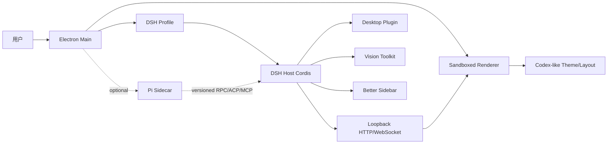

# DSH Desktop 产品可行性分析

> 状态：方案基线
>
> 分析范围：`DSH Desktop + Vision Toolkit + Better Sidebar + Codex-like UI`
>
> 数据时点：2026-08-16；GitHub/NPM 的部分发布时间按 UTC 已进入 2026-08-17。

## 结论先看

本方案合理，且比“用 Pi 替换 DeepSeek Harness 核心”更容易稳定落地。

推荐的产品边界是：

- 以 [DSH Desktop](https://github.com/anywhere-labs/deepseek-harness-desktop) 的 Electron 壳为桌面基座。
- 以官方 [DeepSeek Harness](https://github.com/deepseek-ai/deepseek-harness) 为 Agent、Session、Tool、Profile 和插件运行时。
- 预装 [DSH Vision Toolkit](https://github.com/Anionex/dsh-vision-toolkit) 和 [DSH Better Sidebar](https://github.com/omdsh-dev/DSH-better-sidebar)。
- 使用 DSH 的 Client Slot、Theme Token 和 Service 做 Codex-like 视觉与交互层。
- Pi 暂不进入主运行时；如确有需求，后续以独立 Sidecar 或任务执行器接入。

“Pi 作为 DSH 的替代核心”不适合作为第一版目标。Pi 和 DSH 都是 TypeScript/Node 项目，但 Agent loop、会话、插件生命周期、权限、Web UI 和持久化协议不同，现有两个 DSH 插件不能直接迁移到 Pi。

## 证据与版本快照

| 项目 | 本次核对结果 | 对方案的影响 |
| --- | --- | --- |
| Pi | `v0.84.2`；提供 `pi-agent-core`、`pi-ai`、TUI、SDK、RPC、CBOR `client/server` | 可作为独立 Agent 内核或 Sidecar；不能直接承载 DSH 插件 |
| DeepSeek Harness | GitHub 主线显示 `0.1.0-rc.5`；NPM 最新为 `@deepseek-ai/dsh@0.1.0-rc.6`；项目自称 Developer Preview | 必须固定已发布包，不能直接跟随主线源码 |
| DSH Desktop | GitHub 发布 `v2.0.0`；仓库主线 package 已到 `2.0.1`；Electron `43.4.0`、React `18.3.1`、Electron Builder `26.15.3` | 已有可复用的窗口、托盘、Profile、pnpm、更新和打包实现；生产构建应固定 release tag |
| Vision Toolkit | `v0.1.24`；peer 依赖 DSH `rc.6`；Python `3.11+`；HTML 截图需要 Chrome/Chromium/Edge | 功能集成度高，但存在远程图片、Python、浏览器和免费服务限流边界 |
| Better Sidebar | `v0.12.3`；peer 依赖 DSH `rc.6`；包含文件、编辑器、浏览器、终端、Git、子代理和后台任务 | 能显著补齐桌面工作台，但依赖 Portal、DOM 测量、CSS 变量和 `node-pty` |
| 许可证 | 五个核心仓库均为 MIT；Vision Toolkit 还携带上游视觉工具的 MIT 许可证 | 可再分发，但必须保留版权、许可证和第三方声明，并明确非 DeepSeek 官方产品 |

关键来源：

- [Pi v0.84.2](https://github.com/earendil-works/pi/releases/tag/v0.84.2)
- [DSH Desktop v2.0.0](https://github.com/anywhere-labs/deepseek-harness-desktop/releases/tag/v2.0.0)
- [Vision Toolkit v0.1.24](https://github.com/Anionex/dsh-vision-toolkit/releases/tag/v0.1.24)
- [Better Sidebar v0.12.3](https://github.com/omdsh-dev/DSH-better-sidebar/releases/tag/v0.12.3)

## 架构差异

### DSH 的核心边界

DSH 是 Cordis 驱动的 Host/Client 双半插件系统。Profile 通过 bundle 和 `cordis.patch.yml` 组合能力，插件通过 `ctx` 暴露 Service、Tool、Route、Slot 和事件。官方 Web UI、Session、Credential、Artifact、权限和沙箱都属于这套运行时的一部分。

### Pi 的核心边界

Pi 是终端优先的 coding agent harness，支持 interactive、print/JSON、RPC 和 SDK 四种模式。其 `pi-client` 使用长度前缀 CBOR 消息，`pi-server` README 明确标注为 experimental。Pi README 还明确说明：默认没有文件、进程、网络或凭据权限系统，需要由容器或外部沙箱提供隔离。

### 不兼容点

| 领域 | DSH | Pi | 结果 |
| --- | --- | --- | --- |
| Agent loop | DSH Agent、Goal、Tool、Compaction、Session 事件 | `pi-agent-core` 和 Pi 自有状态管理 | 不能无适配替换 |
| 插件模型 | Cordis Plugin、Host/Client、Profile、Slot | TypeScript Extension、Skill、Prompt、Theme | DSH 插件不能原样加载 |
| UI | DSH Web React、Slot、Theme Token | 终端 UI 和扩展 UI | Better Sidebar 不能直接使用 |
| 传输 | DSH Web HTTP/WebSocket、Host/Client runner | RPC/CBOR、Unix socket、SDK | 需要协议适配层 |
| 权限 | DSH sandbox、PowerShell ACL、Permission Preset | 默认按启动进程权限运行 | Pi 直替会降低安全边界 |
| 持久化 | DSH Session、Storage、Artifact、Profile | Pi JSONL Session 和自有 metadata | 会话模型需要迁移或双写 |

因此，“Pi 重新打包 DSH”本质上会变成新的平台工程，而不是包装工程。

## 推荐架构

边界原则：

1. Electron Main 只负责窗口、托盘、Profile、更新、打包和受管进程。
2. DSH Host 继续拥有 Agent、Session、Tool、Credential、Artifact 和插件生命周期。
3. Renderer 只加载同源 loopback Web UI，不接收原始 Electron API，不自建第二套插件注册表。
4. Vision Toolkit 和 Better Sidebar 通过 Profile 组合，不能复制进 Electron Renderer。
5. Pi 若接入，必须是独立进程，并通过版本化协议和权限代理访问 DSH。

## 功能可行性

| 目标 | 判断 | 需要保留的边界 |
| --- | --- | --- |
| 原生桌面端 | 高 | DSH Desktop 已有 Electron、单实例、托盘、窗口隐藏/恢复、更新和安装器 |
| Codex-like UI | 中高 | 参考布局和交互，不复制 Codex 品牌、源码、图标或商标；优先使用 DSH Slot/Theme |
| Vision Toolkit | 高 | 预装版本固定；提供远程视觉告知、自有 Endpoint、凭据管理和离线本地图像工具 |
| Better Sidebar | 高但需验证 | 先在 compatibility 模式挂载，再验证 advanced 模式的右侧栏、底部面板和标题栏偏移 |
| Pi Sidecar | 中 | 用于独立 Agent、批处理或兼容 Pi Extension；不共享 DSH 主进程权限 |
| 完全离线 | 中低 | 本地裁剪/像素差异可离线；视觉理解、OCR、Grounding 和 HTML 截图有外部运行时依赖 |

## 插件集成重点

### Vision Toolkit

Vision Toolkit 已经是 DSH 原生插件，不应改造成 Electron 专用模块。它提供图片粘贴变体、视觉问答、Grounding、检测、长图 OCR、UI 还原、像素差异和 Artifact 展示。

必须在产品层明确以下事实：

- 默认免费视觉服务是第三方公共端点，图片理解类请求会上传图片。
- 公共服务存在配额、并发和 `429`；不能把它当作产品 SLA。
- 本地处理包括裁剪、像素差异、颜色分析、前景提取和 SVG 描摹。
- Python 环境默认由插件管理，首次启动可能需要网络和包缓存。
- `vision_html_screenshot` 需要本机 Chrome、Chromium 或 Edge。

### Better Sidebar

Better Sidebar 适合做桌面工作台，包含右侧栏和底部面板，并公开 `ctx.betterSidebar` 服务供其他插件注册 Tab 和 File Viewer。其功能包括 Explorer、CodeMirror 编辑器、浏览器、xterm.js 终端、Git、子代理和后台任务。

集成时要避免：

- 同时挂载两个 Better Sidebar 实例；
- 通过 value import 侵入其他插件内部模块；
- 依赖未声明的 DSH DOM 结构；
- 在 `node-pty` 缺失时让整个 Host 崩溃；
- 让终端、文件和 Git 操作绕过 DSH 的会话 cwd 与信任围栏。

## Codex-like UI 的合理范围

建议实现以下信息架构：

- 左侧：会话、项目、Profile 和快速入口；
- 中央：对话、流式 Agent 状态、工具调用和结果；
- 右侧：Better Sidebar 的 Explorer、Git、Browser、Subagent；
- 底部：Terminal、后台任务、Diff 和日志；
- 全局：命令搜索、快捷键、主题切换、密度和窗口状态持久化。

DSH Desktop 的 advanced mode 已经实现原生标题栏、Mica/Vibrancy、桌面 Frame 和 layout service，但 Better Sidebar 使用 fixed Portal、DOM 测量和 CSS 变量。因此必须做联合测试，不能仅凭两边各自的单元测试判断兼容。

## 主要风险与缓解措施

| 风险 | 等级 | 缓解措施 |
| --- | --- | --- |
| DSH Developer Preview 破坏兼容 | 高 | 固定 npm release、锁文件、兼容矩阵、升级前 canary |
| GitHub 主线与 npm 版本不一致 | 高 | 生产只使用 release/tag；不把 DSH `rc.5` 源码与 Desktop `rc.6` 依赖混用 |
| Better Sidebar 与 Advanced Shell 布局冲突 | 中高 | compatibility/advanced 双模式 E2E、截图回归、窗口尺寸矩阵 |
| `node-pty`、`sharp`、`koffi` 等原生模块 | 高 | 在目标 OS/架构原生构建；使用 ASAR unpack；做 packaged-runtime gate |
| Vision 远程图片和公共额度 | 高 | 明示同意、自定义 Endpoint、数据最小化、离线开关、429 重试策略 |
| Python/Chrome 首次运行失败 | 中高 | Health Check、可选预置运行时、下载失败恢复、离线安装说明 |
| npm 插件执行任意代码 | 高 | Profile allowlist、签名/Provenance、SBOM、第三方声明、安装确认 |
| Pi 侧车越权 | 高 | 独立进程、最小权限、路径和命令代理、超时/取消、禁止 Renderer 直连 |
| 品牌和再分发边界 | 中 | 保留 MIT 通知，注明社区项目，不暗示 DeepSeek 官方背书 |

## 当前技术趋势

本次查询到的相关版本和行业信号：

- [Electron 43.4.0](https://github.com/electron/electron/releases/tag/v43.4.0) 和 [Node 24.19.0 LTS](https://github.com/nodejs/node/releases/tag/v24.19.0) 适合本项目的桌面运行时基线。
- [React 19.2.8](https://github.com/facebook/react/releases/tag/v19.2.8) 已发布，但 DSH 生态固定 React 18.3.1，不应在第一阶段单独升级。
- [Playwright 1.62.1](https://github.com/microsoft/playwright/releases/tag/v1.62.1) 适合做真实 Profile 挂载和界面回归。
- [MCP 2026-07-28 规范](https://github.com/modelcontextprotocol/modelcontextprotocol/releases/tag/2026-07-28) 与 [ACP schema v2 alpha.2](https://github.com/agentclientprotocol/agent-client-protocol/releases/tag/schema-v2.0.0-alpha.2) 仍在快速演进，Agent 互操作应通过版本化 Adapter，不应直接耦合私有对象。
- [Tauri 2.11.5](https://github.com/tauri-apps/tauri/releases/tag/tauri-v2.11.5) 更轻，但会重写 DSH 当前依赖的 Node/Electron/native-module 运行边界，因此不适合第一版切换。

## 证据、结论与实施路径

| Evidence | Finding | Path |
| --- | --- | --- |
| DSH Desktop 已实现 Electron Host、Profile、pnpm、托盘和安装器 | 桌面壳无需从零开发 | Fork DSH Desktop release，保留其 Host/Client 边界 |
| Vision Toolkit 与 Better Sidebar peer 依赖 DSH `rc.6` | 两个功能可以作为 Profile 插件预装 | 固定插件版本，做双模式挂载测试 |
| Pi 使用不同的 Agent、Session、Extension 和权限模型 | Pi 不是 DSH 的直接替代内核 | 第一版排除 Pi；后续通过 Sidecar/Adapter 接入 |
| Vision 有第三方远程视觉服务和 Python/Chrome 依赖 | “完全离线、一键可用”需要产品化处理 | 增加隐私同意、健康检查、缓存和可选本地运行时 |
| Better Sidebar 使用 Portal、DOM 测量和 `node-pty` | 单仓库通过不代表与 Desktop advanced mode 联合通过 | 建立窗口尺寸、主题、会话和原生终端 E2E 矩阵 |

## 最终决策

本项目应采用以下决策：

1. Fork [DSH Desktop](https://github.com/anywhere-labs/deepseek-harness-desktop)，不从 Pi 重写桌面基座。
2. 使用已发布的 DSH `0.1.0-rc.6` family，不直接依赖未发布源码主线。
3. 将 Vision Toolkit `0.1.24` 和 Better Sidebar `0.12.3` 作为默认 Profile 能力。
4. 第一版先交付稳定桌面端、工作台和视觉闭环，Pi 不进入关键路径。
5. Pi 仅作为后续独立 Agent/任务执行 Sidecar，须经过权限、协议和故障隔离设计。

