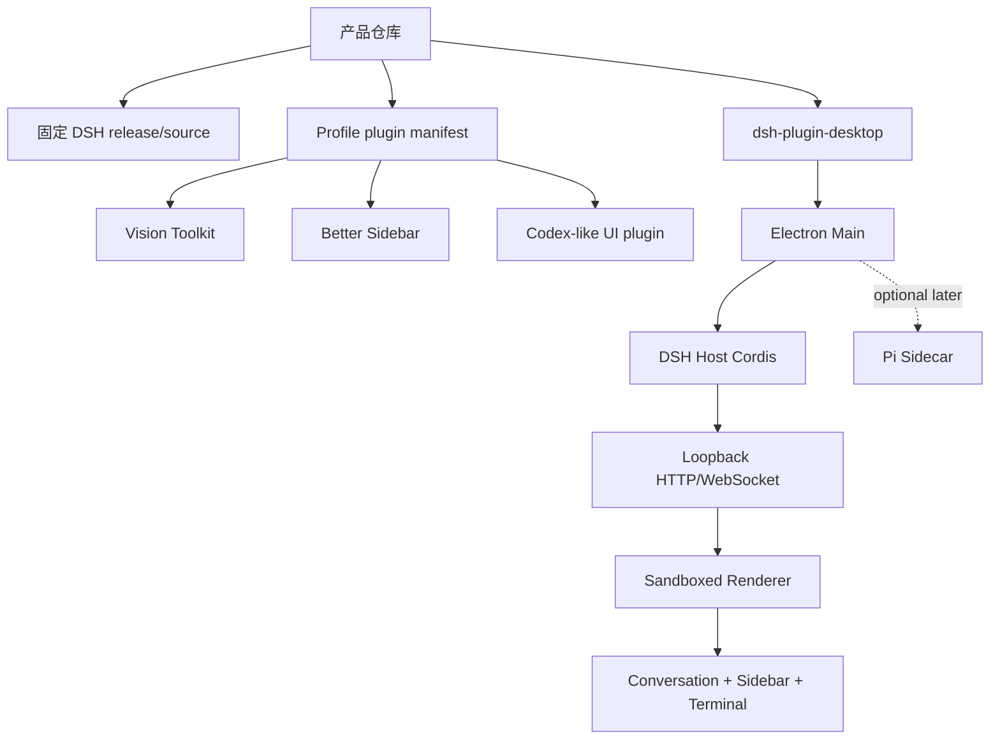
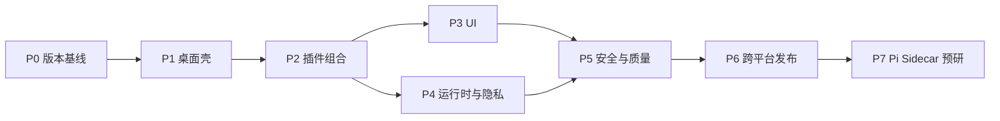

# DSH Desktop 开发任务规划

> 目标：交付一个以 DSH Desktop 为基座、预装 Vision Toolkit 和 Better Sidebar、采用 Codex-like 交互布局的 Windows/macOS 桌面应用。
>
> 关联分析：[DSH Desktop 产品可行性分析](./01-feasibility-analysis.md)
>
> 规划原则：先稳定官方 DSH Profile 和桌面生命周期，再做视觉层；Pi 不进入第一版关键路径。

## 目标与非目标

### 目标

- 安装包无需用户预装 Node.js、pnpm 或 DSH。
- 首次启动可以创建并管理默认 DSH Profile。
- Vision Toolkit 和 Better Sidebar 以官方插件方式加载、升级和卸载。
- 兼容模式和 Advanced 模式都能启动，且模式切换可恢复。
- 提供 Codex-like 的会话、对话、侧边工作台和底部任务区体验。
- Windows x64、macOS Apple Silicon/Intel 具备可发布的构建和测试路径。
- 所有第三方依赖具备锁定版本、许可证、SBOM 和发布记录。

### 非目标

- 第一版不替换 DSH Agent、Session、Tool 或 Permission 模型。
- 第一版不把 Pi 嵌入 Electron Main，也不让 Pi 直接访问 Renderer。
- 第一版不承诺视觉理解完全离线。
- 第一版不做插件市场、移动端远程控制或多机协同。
- 第一版不复制 Codex 的品牌资产、源码、商标或产品文案。

## 技术基线

| 层 | 基线 | 固定策略 |
| --- | --- | --- |
| 桌面壳 | Electron `43.4.0`、Electron Builder `26.15.3` | 固定版本，升级需经过打包和安全回归 |
| 运行时 | Node `22.19+` 或 `24.x` | 发布优先使用 Node 24 LTS；不使用 Node 26 作为首发基线 |
| 前端 | React `18.3.1`、DSH Theme/Slot | 不单独升级 React 19，避免破坏 DSH Client contract |
| 包管理 | 内置 pnpm `11.7.0`、外层 Yarn | 使用 Desktop 的受管 Profile 操作，不拼接 shell 命令 |
| DSH | NPM `@deepseek-ai/dsh@0.1.0-rc.6` family | 不使用 GitHub 未发布主线作为生产依赖 |
| Vision | `@anionex/dsh-vision-toolkit@0.1.24` | 固定版本，默认关闭隐式数据上传解释不足的问题 |
| Sidebar | `dsh-better-sidebar@0.12.3` | 固定版本，单实例挂载 |
| 测试 | Vitest、Playwright `1.62.1`、原生打包 smoke | 单元、挂载、窗口和安装包分层执行 |
| 未来 Agent 互操作 | ACP/MCP Adapter | 仅在 Sidecar 阶段设计，不改变第一版 DSH 内部协议 |

## 目标架构

## 阶段总览

| 阶段 | 名称 | 主要结果 | 退出条件 |
| --- | --- | --- | --- |
| P0 | 仓库和版本基线 | 可复现 checkout、锁文件和许可证清单 | 干净机器可以安装并解析全部依赖 |
| P1 | 桌面壳基线 | DSH Desktop 可启动、退出、恢复和切换 Profile | compatibility 模式通过启动/重启 smoke |
| P2 | 插件组合 | Vision Toolkit 和 Better Sidebar 在 desktop Profile 可用 | 两插件无重复挂载、Host/Client 无错误 |
| P3 | Codex-like UI | 主题、布局、导航、快捷键和工作台完成 | 视觉回归和可用性检查通过 |
| P4 | 运行时与隐私 | Python/浏览器健康检查、视觉数据告知、凭据管理 | 离线/限流/缺依赖状态可解释恢复 |
| P5 | 安全与质量门禁 | 权限、供应链、崩溃恢复和测试矩阵 | 高风险问题关闭，CI 全绿 |
| P6 | 跨平台发布 | Windows/macOS 安装包、签名、公证和更新 | 真机安装、升级、卸载和回滚通过 |
| P7 | Pi Sidecar 预研 | 可选 Pi Agent Bridge 设计和隔离原型 | 不影响主产品，协议和权限边界明确 |

## P0：仓库和版本基线

| ID | 任务 | 依赖 | 交付物 | 验收标准 |
| --- | --- | --- | --- | --- |
| P0-01 | Fork DSH Desktop 并保留上游来源说明 | 无 | 产品仓库、上游来源文档 | 能追溯上游 commit、release 和本地改动 |
| P0-02 | 固定 DSH `rc.6` family | P0-01 | 精确依赖清单、lockfile | 不解析到 `rc.5` 或未发布主线包 |
| P0-03 | 固定 Vision `0.1.24`、Sidebar `0.12.3` | P0-02 | Profile 依赖清单 | `pnpm install --frozen-lockfile` 成功 |
| P0-04 | 建立第三方许可证和 SBOM 生成流程 | P0-02 | `THIRD_PARTY_NOTICES`、SBOM 制品 | 每次发布能生成依赖版本、许可证和来源 |
| P0-05 | 定义版本升级策略 | P0-02 | Upgrade policy、兼容矩阵 | 升级必须包含 canary、挂载和打包回归 |

## P1：桌面壳基线

| ID | 任务 | 依赖 | 交付物 | 验收标准 |
| --- | --- | --- | --- | --- |
| P1-01 | 启动单实例 Electron Main | P0 | Main 生命周期 | 第二次启动唤醒已有窗口，不创建第二个 Host |
| P1-02 | 验证 `desktop` 和 `web` Profile 发现 | P1-01 | Profile 状态和回滚测试 | 损坏或不可用 Profile 不会阻塞应用启动 |
| P1-03 | 验证内置 Node/pnpm 和受管 `runPlugin` | P1-02 | Profile 安装服务 | 安装、更新、卸载不拼接 shell 字符串，取消可回收完整进程树 |
| P1-04 | 验证 loopback Web carrier 和 Renderer sandbox | P1-01 | BrowserWindow 配置和 smoke | contextIsolation、sandbox、Node integration 关闭，导航限制在受信 Origin |
| P1-05 | 验证托盘、隐藏、恢复、退出和有序 dispose | P1-01 | 生命周期测试 | 窗口关闭只隐藏；显式退出能在超时后安全结束 |
| P1-06 | 先交付 compatibility 模式 | P1-01 | 可运行开发版 | 官方 DSH Web UI 无额外布局覆盖，干净 Profile 可启动 |

## P2：插件组合

| ID | 任务 | 依赖 | 交付物 | 验收标准 |
| --- | --- | --- | --- | --- |
| P2-01 | 通过 Desktop Profile 安装 Vision Toolkit | P1-03 | Profile bundle 配置 | 重启后 Settings、工具和 Artifact 路由均可用 |
| P2-02 | 通过 Desktop Profile 安装 Better Sidebar | P1-03 | Profile bundle 配置 | 只出现一个 Sidebar，插件不修改 DSH 源码 |
| P2-03 | 验证 Vision 图片输入闭环 | P2-01 | Playwright 场景 | 粘贴图片、模型变体切换、视觉回答、Artifact 预览可重复 |
| P2-04 | 验证 Vision 本地工具 | P2-01 | Python/Chrome health test | crop、pixel diff、color、foreground、SVG 工具在本地可用 |
| P2-05 | 验证 Sidebar 文件和 Git 工作台 | P2-02 | E2E 场景 | Explorer、编辑、Diff、Git 状态和文件写入都限定到会话 cwd |
| P2-06 | 验证 Sidebar 终端和后台任务 | P2-02 | 原生模块 smoke | `node-pty` 可用时终端工作；不可用时仅显示修复提示，不拖垮 Host |
| P2-07 | 验证会话隔离和持久化 | P2-02 | 双会话测试 | Tab、布局、终端和任务状态不会跨会话串线 |
| P2-08 | 验证第三方插件注册 API | P2-02 | 示例插件或测试 fixture | `registerTab`、`registerFileViewer`、settings 和 disposer 生命周期正确 |

## P3：Codex-like UI

| ID | 任务 | 依赖 | 交付物 | 验收标准 |
| --- | --- | --- | --- | --- |
| P3-01 | 定义视觉 Token 和布局规范 | P2 | UI spec、Token map | 颜色、密度、间距、圆角、状态和动效有单一来源 |
| P3-02 | 实现左侧会话/项目导航 | P3-01 | Client Slot/Theme 插件 | 会话切换、Profile 入口、状态提示与 DSH Session 一致 |
| P3-03 | 实现中央对话和 Agent 状态层 | P3-01 | Conversation contributions | 流式输出、工具调用、错误、取消和重试不改变 DSH 语义 |
| P3-04 | 组合右侧 Better Sidebar | P2-02, P3-01 | Advanced Shell 适配 | 右侧栏不遮挡输入框、标题栏、详情面板和外链提示 |
| P3-05 | 组合底部 Terminal/Task/Diff 面板 | P2-06, P3-01 | Layout contribution | 面板拖拽、收起、恢复和窄窗口降级可用 |
| P3-06 | 实现命令搜索和快捷键 | P3-02 | Command surface | 快捷键不覆盖 DSH、浏览器和终端的原有组合键 |
| P3-07 | 做主题和窗口状态持久化 | P3-01 | Settings/Theme 状态 | light/dark/system 和窗口布局跨重启恢复 |
| P3-08 | 完成 accessibility 和 reduced motion | P3-02 | A11y 检查清单 | 键盘导航、焦点、对比度、减少动效模式通过检查 |

## P4：运行时、隐私和用户恢复

| ID | 任务 | 依赖 | 交付物 | 验收标准 |
| --- | --- | --- | --- | --- |
| P4-01 | 实现 Vision 首次运行向导 | P2-03 | Settings/Health UI | 用户知道图片何时会上传、默认 Endpoint 是什么、如何替换 |
| P4-02 | 实现视觉服务配置和凭据存储 | P2-01 | Credential integration | API Key 不出现在 Renderer snapshot、日志、错误和安装包 |
| P4-03 | 实现 Python Runtime Manager 状态展示 | P2-04 | Health panel | 缺 Python、依赖、权限、磁盘或网络时给出可操作错误 |
| P4-04 | 实现 Chrome/Chromium 探测 | P2-04 | Browser health check | 只有 HTML 截图功能受影响，其他 Vision 工具仍可用 |
| P4-05 | 处理公共视觉服务 429/超时/取消 | P2-03 | 重试和错误分类 | 按 Retry-After 或明确错误提示，不进行无限重试 |
| P4-06 | 实现 Profile/插件升级回滚 | P1-03 | Backup/restore flow | 新版本挂载失败时能恢复原 lockfile、manifest 和 last-known-good |
| P4-07 | 收集本地诊断而不上传业务内容 | P4-01 | Diagnostics bundle | 日志可定位安装问题，但不含 API Key、图片或完整对话 |

## P5：安全与质量门禁

| ID | 任务 | 依赖 | 交付物 | 验收标准 |
| --- | --- | --- | --- | --- |
| P5-01 | 审查 Renderer/Main 信任边界 | P1-04 | Threat model | Renderer 无 Node 权限；外链、导航和 IPC 均有 allowlist |
| P5-02 | 审查 DSH Profile 插件安装边界 | P2 | Plugin policy | 安装前显示来源、版本、权限和许可证；可禁用或移除插件 |
| P5-03 | 审查 Vision 数据流 | P4-01 | Privacy review | 远程图片、凭据、Artifact、日志和缓存均有数据流记录 |
| P5-04 | 审查 Better Sidebar 文件/终端边界 | P2-05, P2-06 | Security tests | cwd、Host trust fence、原子写入、PTY 和 HTML sandbox 不越界 |
| P5-05 | 验证 npm provenance、lockfile 和 SBOM | P0-04 | Supply-chain gate | 未审查 install script、未声明依赖和许可证缺失会阻断发布 |
| P5-06 | 建立崩溃和插件恢复界面 | P1-05, P2 | Recovery dialog | 单个插件失败时能显示插件名、错误摘要、更新/移除入口 |
| P5-07 | 建立性能预算 | P3 | Perf report | 首屏核心 bundle、Sidebar lazy chunk、内存、PTY 和图片任务均有阈值 |

## P6：跨平台发布

| ID | 任务 | 依赖 | 交付物 | 验收标准 |
| --- | --- | --- | --- | --- |
| P6-01 | Windows x64 原生构建 | P5 | NSIS installer | 干净 Windows 安装、启动、终端、升级、卸载和用户数据保留通过 |
| P6-02 | macOS arm64 构建 | P5 | DMG | Apple Silicon 安装、窗口材质、终端、签名和公证通过 |
| P6-03 | macOS x64/universal 构建 | P5 | Universal DMG | Intel 与 Apple Silicon 均可启动，原生模块架构正确 |
| P6-04 | 代码签名和公证 | P6-01, P6-02 | Signed artifacts | Windows Authenticode、macOS Developer ID 和 notarization 成功 |
| P6-05 | 自动更新和回滚 | P4-06, P6-01, P6-02 | Update channel | 下载前版本确认、断点失败、安装失败和回滚均可恢复 |
| P6-06 | 发布检查清单和制品归档 | P6-04 | Release record | 安装包、SHA-256、SBOM、NOTICE、源码 commit 和测试报告齐全 |
| P6-07 | 建立 beta/canary 通道 | P5-05 | Release channels | DSH、插件和桌面壳升级可以分阶段放量 |

## P7：Pi Sidecar 预研

此阶段不是第一版发布阻塞项。只有 P6 完成后才进入。

| ID | 任务 | 依赖 | 交付物 | 验收标准 |
| --- | --- | --- | --- | --- |
| P7-01 | 定义 Pi 与 DSH 的职责边界 | P6 | Sidecar RFC | 明确 Session、Tool、Artifact、权限和取消的所有权 |
| P7-02 | 选择 ACP/MCP 或版本化 RPC | P7-01 | Protocol decision | 不直接依赖 Pi 内部对象；具备版本和能力协商 |
| P7-03 | 实现最小 Pi Sidecar 启停和健康检查 | P7-02 | Isolated worker | Sidecar 崩溃不影响 DSH Host；可取消、超时和重启 |
| P7-04 | 实现只读工作区任务 | P7-03 | Safe pilot | 默认只读路径，不能访问凭据、安装器或任意系统命令 |
| P7-05 | 实现结果回写 DSH Artifact/Session | P7-04 | Adapter tests | 结果可追踪、可重放、可取消，不重复写入会话 |
| P7-06 | 评估是否进入正式产品 | P7-05 | Go/no-go report | 只有在性能、权限和维护成本可接受时才扩大范围 |

## 关键验收矩阵

| 场景 | Windows x64 | macOS arm64 | macOS x64 | compatibility | advanced |
| --- | --- | --- | --- | --- | --- |
| 干净安装和首次启动 | 必测 | 必测 | 必测 | 必测 | 必测 |
| Profile 创建、切换、回滚 | 必测 | 必测 | 必测 | 必测 | 必测 |
| Vision 图片问答 | 必测 | 必测 | 建议 | 必测 | 必测 |
| Vision Python 工具 | 必测 | 必测 | 建议 | 必测 | 必测 |
| HTML 截图和浏览器探测 | 必测 | 必测 | 建议 | 必测 | 必测 |
| Sidebar Explorer/Editor/Git | 必测 | 必测 | 建议 | 必测 | 必测 |
| Sidebar node-pty 终端 | 必测 | 必测 | 建议 | 必测 | 必测 |
| 会话隔离和布局持久化 | 必测 | 必测 | 建议 | 必测 | 必测 |
| 插件失败恢复 | 必测 | 必测 | 必测 | 必测 | 必测 |
| 安装包升级和回滚 | 必测 | 必测 | 必测 | 不适用 | 不适用 |

## 质量门禁

提交合并前：

- TypeScript 类型检查、Lint、单元测试通过。
- DSH Profile 能在全新 scratch 目录安装并挂载所有插件。
- Playwright 无 `pageerror`、无插件 console error、无重复 Sidebar。
- Vision 测试覆盖远程成功、429、超时、缺凭据、缺 Python、缺 Chrome 和取消。
- Sidebar 测试覆盖 session cwd、软链接、原子写入、Git 操作、PTY 缺失和 HTML sandbox。
- Electron smoke 验证单实例、托盘、隐藏/恢复、退出、导航限制和 Renderer sandbox。
- 许可证、Provenance、lockfile、SBOM 和第三方声明检查通过。

发布前：

- Windows x64 安装包在无 Node/pnpm/DSH 的机器上启动。
- macOS arm64 和 x64 安装包通过签名、公证和 Gatekeeper 检查。
- 自动更新只接受稳定 Semantic Version，下载失败不破坏当前安装。
- 任何插件挂载失败都能进入恢复界面，而不是显示空白窗口。
- 产物、哈希、源码 commit、依赖清单、测试报告和已知限制归档。

## 关键路径与并行关系

并行建议：

- P1 进行时，可以准备 P0 的 SBOM、许可证和版本升级脚本。
- P2 进行时，可以并行编写 Vision 健康检查和 Sidebar E2E fixture。
- P3 进行时，可以并行建立窗口尺寸、主题和截图回归基线。
- P4/P5 可以并行，但任何隐私和权限结论必须在 UI 文案冻结前确认。
- P6 必须等待 P5 的安全门禁，不应先做“能安装”的未签名公开包。

## 建议的首个可交付版本

首个 Beta 应只承诺：

1. Windows x64 和 macOS arm64 安装包。
2. DSH `rc.6` 固定 Profile。
3. Vision Toolkit 和 Better Sidebar 预装且可禁用。
4. compatibility 模式稳定，advanced 模式标记为 Beta。
5. Vision 远程服务有明确告知和自定义 Endpoint。
6. Sidebar Explorer、Editor、Git、Terminal 和 Subagent 基础能力可用。
7. 插件失败、Python 缺失、Chrome 缺失和公共服务限流有恢复路径。
8. 签名、SBOM、许可证和安装包升级流程完整。

Pi Sidecar、插件市场、离线视觉模型、Linux Advanced 模式和移动端控制都应排在 Beta 之后。

## Definition of Done

一个版本只有同时满足以下条件，才可以称为完成：

- 代码、Profile、依赖、安装包和文档都指向同一组固定版本。
- 关键用户流程在目标平台和两种 Desktop 模式下通过。
- 插件可以安装、禁用、升级、失败恢复和卸载。
- 图片、凭据、会话、文件、终端和日志的数据边界已记录并验证。
- 原生模块、Python、Chrome、Electron sandbox 和代码签名已在真实环境验证。
- 没有把 Pi、未发布 DSH 主线或未经审查的动态插件依赖放入关键路径。
- 发布制品可由第三方根据源码 commit、lockfile、SBOM 和测试报告复现来源。

