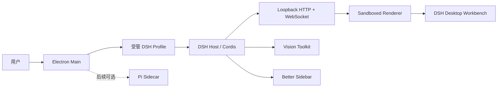

# DSH Desktop 完整开发报告

> 文档日期：2026-08-18  
> 产品仓库：<https://github.com/rw0104/DSH-desktop>  
> 当前产品版本：`1.0.2`  
> 当前 Windows Release：<https://github.com/rw0104/DSH-desktop/releases/tag/v1.0.2>  
> 文档范围：从最初需求、方案决策、架构与实施，到当前发布状态、已知风险和下一阶段计划。

## 1. 执行摘要

DSH Desktop 最初来自一个“使用 Pi 重新包装 DeepSeek Harness，并参考 Codex 桌面端体验”的设想。经过可行性分析后，项目没有用 Pi 替换 DeepSeek Harness 的 Agent、Session、Tool 和插件运行时，而是确定了更可控的产品边界：以官方 DeepSeek Harness 作为 Agent/Web Runtime，以 Electron 桌面壳承载窗口、Profile、托盘、安装和更新，以 Vision Toolkit 与 Better Sidebar 作为固定产品插件，再在桌面自有 Client 层实现原生窗口和工作台组合。

项目已经从方案阶段进入可安装产品阶段。当前 `v1.0.2` 提供 Windows x64 NSIS 安装器，包含 DSH Runtime、Vision Toolkit、Better Sidebar、Windows 真实盘符选择、中文隐私提示、启动反馈、受管终端和 GitHub Release 发布流程。产品 README 已从内部开发报告改写为面向最终用户的产品介绍。

当前仍未达到“所有平台生产发布完成”的状态。Windows 安装器尚未进行 Authenticode 签名，SmartScreen 信誉、干净机器升级/卸载矩阵仍需完善；macOS 签名、公证和 DMG 真机验证尚未完成；第三方许可证清单和 SBOM 也未形成正式发布制品。

### 1.1 文档事实来源

本报告不依赖超长聊天中每一条逐字记录，而是使用以下可验证来源重建完整过程：

1. 用户在当前任务中的历次明确要求；
2. [可行性分析](./01-feasibility-analysis.md)、[开发任务规划](./02-development-plan.md)和[阶段开发记录](./03-development-log.md)；
3. Git 提交历史、版本标签和仓库规则；
4. Electron 截图、Windows 制品、内存和 Vision 运行时证据；
5. GitHub Actions 和 GitHub Release 的当前状态。

聊天中被折叠的中间回复不作为唯一证据。代码、测试、提交和发布制品与口头描述冲突时，以仓库事实为准。

## 2. 原始需求与需求演进

### 2.1 最初需求

最初设想包含四个核心输入：

- 使用 [Pi](https://github.com/earendil-works/pi) 重新打包 [DeepSeek Harness](https://github.com/deepseek-ai/deepseek-harness)；
- 构建原生桌面客户端；
- GUI 参考 Codex 桌面端的信息架构和视觉体验；
- 集成 [Vision Toolkit](https://github.com/Anionex/dsh-vision-toolkit) 与 [Better Sidebar](https://github.com/omdsh-dev/DSH-better-sidebar)，并参考已有 DSH Desktop 同类实现。

### 2.2 需求演进

| 阶段 | 用户要求 | 形成的产品决策 |
| --- | --- | --- |
| 可行性分析 | 判断 Pi + DSH + Vision + Sidebar + Codex-like UI 是否合理 | Pi 与 DSH 的运行时边界不兼容，第一版不替换 DSH 核心 |
| 方案确认 | 采用“DSH Desktop + Vision Toolkit + Better Sidebar + Codex-like UI” | 以 Electron/DSH 为主线，Vision 与 Sidebar 通过 Profile 组合 |
| 独立产品定位 | 产品属于 `rw0104`，只能借鉴其他项目思路，README 不能写成维护他人仓库 | 仓库、README、版本和 Release 统一为 `rw0104/DSH-desktop` |
| 正式发布体验 | README 要像正式产品，提供桌面截图和安装包 | 根 README 改为产品介绍，Release 提供 Windows 安装器 |
| 性能与启动 | 安装慢、启动慢、安装后点击无界面 | 优化 Vision 启动关键路径，增加原生启动反馈和错误对话框 |
| 本地化 | 新安装提醒跟随系统语言 | 使用 Electron `app.getLocale()`，中文系统显示中文隐私提示 |
| 界面修正 | 去除额外英文硬编码、恢复右侧栏、收窄左栏 | 删除重复控制条，修复 locale 注入，左栏默认宽度改为 240 px |
| 目录选择 | 支持盘符/文件管理器选择，且只显示真实盘符 | Windows Host 探测实际卷；盘符下拉提交规范的 `C:\` 根路径 |
| 安装崩溃 | 安装后缺少 `sharp` 导致 Loader 启动失败 | `sharp` 移入运行时依赖，afterPack 检查 native entry |
| GitHub 构建 | Git 端生成安装包和 Release | 增加 Windows Release workflow、tag 构建和 Release 资产上传 |
| 最终 UI 默认 | 右侧面板默认收起，右上角控件不能重叠 | Better Sidebar 新用户默认手动展开；Windows 默认启用标题栏避让 |
| README 产品化 | README 不应像内部开发报告 | 移除测试证据和阶段报告列表，保留下载、功能、安装和上游关系 |

## 3. 最终产品目标与边界

### 3.1 当前目标

- 提供不要求客户预装 Node.js、pnpm 或 DSH 的 Windows 桌面安装包；
- 使用官方 DSH Runtime 保持 Agent、Session、Tool、Credential 和 Profile 行为；
- 预装并固定 Vision Toolkit 与 Better Sidebar；
- 提供 compatibility 和 Advanced 两种桌面呈现；
- 提供 Codex-like 的工作台信息架构，但不复制 Codex 品牌、图标或源码；
- 通过原生窗口、托盘、启动反馈、Profile、受管终端和更新交接形成完整桌面产品；
- 建立可在 GitHub Actions 复现的 Windows x64 构建和发布路径。

### 3.2 当前非目标

- 不用 Pi 替换第一版 DSH Agent、Session、Tool 或 Permission 模型；
- 不把 Pi 放入 Electron Main 的关键启动路径；
- 不承诺所有 Vision 能力完全离线；
- 不在第一版交付插件市场、移动端远程控制或多机协同；
- 不修改固定的 `deepseek-harness/` 上游子模块源码；
- 不宣称当前未签名 Windows 包已经具备生产级 SmartScreen 信誉。

### 3.3 关键验收标准

| 领域 | 验收标准 | 当前结果 |
| --- | --- | --- |
| 安装与启动 | 安装器可生成；启动时有可见反馈；失败显示原生错误 | 已完成，Windows 包仍未签名 |
| DSH 兼容 | Profile、Host、Web 和插件图可启动 | 已通过 Loader/Profile/CLI smoke |
| Vision | 可按隐私选择启用；Python/浏览器可探测 | 已完成，远程服务仍有外部依赖 |
| Sidebar | Explorer、编辑器、Git、终端等可挂载 | 已完成；新用户默认收起 |
| 目录选择 | 真实盘符、规范根路径、无 `:\` 错误 | 已通过真实 Electron CDP 回归 |
| 本地化 | 中文系统显示中文首次提醒 | 已完成 |
| GitHub 发布 | Windows artifact 和 Release 可下载 | `v1.0.2` 已发布 |
| 跨平台生产发布 | Windows/macOS 签名、公证、安装矩阵 | 未完成 |

## 4. 架构决策

### 4.1 运行时架构



Electron Main 负责单实例、窗口、托盘、Profile、内置 pnpm、终端、更新和进程退出。DSH Host 负责 Agent 与插件生命周期。Renderer 仅加载同源 loopback Web UI，启用 `contextIsolation` 和 sandbox，关闭 Node integration，不暴露原始 Electron API。

### 4.2 为什么第一版不使用 Pi 替换 DSH

Pi 与 DSH 都属于 TypeScript/Node Agent 工程，但二者的 Agent loop、Session、插件模型、权限、持久化和 UI 协议不同。Vision Toolkit 和 Better Sidebar 是 Cordis/DSH Host-Client 插件，无法直接加载到 Pi。直接替换会把“桌面包装项目”升级为“新平台兼容工程”，同时降低第一版可交付性。

因此第一版把 Pi 排除在关键路径之外。未来若引入 Pi，应作为独立进程 Sidecar，通过版本化 ACP/MCP/RPC Adapter 和最小权限代理接入。

### 4.3 仓库与包管理边界

```text
DSH-desktop/
├── deepseek-harness/          固定上游 Git 子模块，只读
├── dsh-plugin-desktop/        Electron、Host/Client、打包与发布测试
├── patches/                   Desktop 自有 Yarn 补丁
├── docs/                      分析、计划、开发记录和证据
├── scripts/                   根级构建与 Electron CDP smoke
└── .github/workflows/         Windows 构建与 Release workflow
```

- 外层仓库使用 Yarn 4.18.0 和 `nodeLinker: node-modules`；
- 上游子模块保留 pnpm workspace；
- 上游命令只能通过根级 `upstream:*` 脚本进入子模块；
- Desktop 功能不得从桌面分支修改 `deepseek-harness/`；
- compatibility 模式必须保留官方默认 Client 组合；
- Advanced 呈现只由桌面自有 Client 插件替换已记录的 Slot/Service。

### 4.4 固定技术版本

| 层 | 当前版本 |
| --- | --- |
| 产品 | `1.0.2` |
| Electron | `43.4.0` |
| React | `18.3.1` |
| Electron Builder | `26.15.3` |
| Yarn | `4.18.0` |
| 内置 pnpm | `11.7.0` |
| DSH npm family | `0.1.0-rc.6` |
| 上游子模块 commit | `47f943859bef60e4160492346772ded9b24f765a` |
| Vision Toolkit | `0.1.24` |
| Better Sidebar | `0.12.3` |
| Sharp | `0.35.3` |

## 5. 分阶段实施过程

### 5.1 P0：方案、仓库与版本基线

- 完成 Pi、DeepSeek Harness、DSH Desktop、Vision Toolkit 和 Better Sidebar 的边界分析；
- 确定第一版以 Electron + DSH 为主，Pi 仅保留后续 Sidecar 可能；
- 建立 `rw0104/DSH-desktop` 独立产品仓库；
- 将官方 DeepSeek Harness 固定为只读 Git 子模块；
- 保留外层 Yarn/上游 pnpm 的双包管理边界；
- 修复 Git 本地提交身份，当前产品提交使用 `rw0104 <294105055+rw0104@users.noreply.github.com>`。

### 5.2 P1：桌面壳与 DSH 生命周期

- 建立 Electron 单实例、窗口、托盘、关闭/退出和有序 dispose；
- 解析并准备受管 DSH Profile；
- 提供内置 pnpm、Profile package fallback 和受管终端；
- 使用 loopback Web carrier 加载 DSH Web UI；
- 为 compatibility/advanced 两种模式配置安全 BrowserWindow；
- 提供下载、更新检查与安装器交接接口。

### 5.3 P2：Vision Toolkit 与 Better Sidebar

- 将 Vision Toolkit `0.1.24` 和 Better Sidebar `0.12.3` 固定到 desktop Profile；
- 保留用户第三方插件顺序，并对同名产品插件去重；
- 验证 Host/Client renderer graph 中两个插件均已挂载；
- Vision 失败或用户拒绝隐私提示时，只停用 Vision，不阻塞 DSH 和 Sidebar；
- Better Sidebar 保持插件自己的服务、Tab、Viewer、终端和会话隔离模型。

### 5.4 P3：Advanced Shell 与工作台体验

- 使用 DSH Slot/Theme 实现桌面自有 root frame；
- 保留官方左侧 sidebar 和 conversation surface；
- Windows 使用 Mica 与 hidden title bar，macOS 使用 vibrancy 与 hidden inset；
- 左栏默认宽度从 280 px 调整到 240 px；
- 布局偏好存入 `localStorage`，窄屏临时状态不持久化；
- 删除与官方/Better Sidebar 重复的 `Workspace / Sidebar / Details` 控制条；
- Better Sidebar 新用户默认收起，用户手动展开；
- Windows 默认启用标题栏兼容间距，避免侧栏按钮覆盖原生 caption controls。

### 5.5 P4：隐私、本地化和运行时健康

- 使用 Electron 原生 dialog 告知 Vision 图片外发边界；
- 通过 `app.getLocale()` 判断系统语言，中文系统显示中文提示；
- 隐私选择使用版本化 JSON 和原子写入持久化；
- Python 健康检查要求 3.11+，当前样本为 Python 3.12.10；
- 浏览器探测支持 Chrome、Chromium 和 Edge；
- HTML 截图缺少浏览器时只影响相应工具，不误报整个 Vision 不可用；
- Vision Python 运行时准备从关键启动路径移到后台初始化。

### 5.6 P5：测试、性能和发布门禁

- 增加 runtime closure、CLI、Loader、Profile、产品插件和 Vision 健康门禁；
- 通过真实 Electron BrowserWindow/CDP 获取截图和 DOM 状态；
- 建立安装器、unpacked 目录、Private Memory 和 Working Set 预算；
- Windows 打包使用 node-pty 预编译 native 模块，避免本机构建 Spectre 库；
- afterPack 检查 app.asar、物理 runtime、pnpm、node-pty、sharp 和平台 native entry；
- Windows-safe package gate 当前样本为 106 passed、1 skipped；
- first-party runtime closure 当前为 197 个可达节点。

### 5.7 P6：Windows Release 与 GitHub 构建

- 建立 NSIS 安装器、blockmap 和 `latest.yml`；
- 增加 `.github/workflows/desktop-release.yml`；
- 手动 workflow 和 `v*` tag 在 `windows-latest` 上执行 `yarn install --immutable` 与 `yarn dist:win`；
- 修复 setup-node 在 Corepack 前调用 Yarn 1 的问题；
- 修复 Release job 缺少 Git metadata 和 checkout 清除下载目录的问题；
- 当前 `v1.0.2` Release 已包含 installer、blockmap 和 latest metadata。

## 6. 关键故障与修复记录

| 用户可见问题 | Evidence | Finding | Path / 修复 |
| --- | --- | --- | --- |
| 首次安装后点击启动长时间无界面 | 冷启动约 13–20 秒后才出现主窗口 | 启动反馈创建点位于耗时 Boot 之后 | `whenReady` 后、DSH Boot 前创建原生启动窗口；主界面成功后关闭 |
| 启动失败没有可见反馈 | GUI 进程只有 stderr | GUI 用户无法看到控制台错误 | 启动失败显示原生 `showErrorBox` |
| 中文系统出现英文首次提示 | 新增文案硬编码英文 | 未使用 Electron locale | `app.getLocale()` + 中英文 copy；中文 locale 匹配 `zh-*` |
| 顶部出现多余英文控制条 | `Workspace / Sidebar / Details` 与插件按钮重复 | DesktopControlStrip 重复表达已有功能 | 删除控制条与样式，恢复原有插件入口 |
| 右侧栏看似消失或默认占满空间 | Better Sidebar 使用独立 fixed Portal | 官方 details 与 Better Sidebar 不是同一面板 | 保留独立职责；新用户默认收起，手动展开 |
| 右上角两个侧栏按钮覆盖原生标题栏 | Windows hidden title bar 与 fixed toggle cluster 共用右上角 | Better Sidebar `titleBarCompat` 默认关闭 | Windows 新用户默认 `titleBarCompat: true`，显式用户设置保持优先 |
| 盘符下拉列出不存在的 C–Z 盘 | Client 硬编码盘符数组 | 没有 Host 盘符事实 | Electron Host 使用 `existsSync("X:\\")` 探测实际卷，Renderer 只显示真实盘符 |
| 选择盘符后路径变为 `:\` | change handler 清空 select 后异步读取值 | 异步时序丢失盘符 | 清空前捕获 `C:\` 不可变路径，再驱动官方路径编辑 |
| 安装后 `Cannot find package 'sharp'` | `dsh-attachment-local` 导入 sharp，产物排除了 sharp/@img | 体积优化破坏运行时闭包 | `sharp` 移入 runtime dependency；afterPack 强制检查 sharp native entry |
| 安装约 3 分钟 | 约 25,000 个物理文件和未签名 PE | Defender/SmartScreen 对大量文件扫描 | 延迟 Vision 初始化、裁剪无用依赖；签名和进一步归档优化仍待完成 |
| GitHub setup-node 失败 | 全局 Yarn 1 读取 `packageManager: yarn@4` | cache 探测发生在 Corepack enable 之前 | 移除 setup-node 的 Yarn cache 探测，之后显式 Corepack enable |
| Release job 找不到资产 | checkout 在下载 artifact 后运行 | checkout 清理未跟踪 `release-assets` | 先 checkout tag，再下载 artifact |
| 提交显示错误账号 | Git/gh 同时存在多个账号 | 仓库身份未固定 | Git config、origin 和 API author 统一为 `rw0104` |

## 7. 当前产品功能状态

| 功能 | 状态 | 说明 |
| --- | --- | --- |
| Windows x64 安装器 | 已发布 | `v1.0.2`，未签名 |
| Electron 单实例/托盘/窗口 | 已完成 | 包含启动反馈和错误对话框 |
| DSH Profile 生命周期 | 已完成 | 选择、pending、last-known-good、失败回滚 |
| Compatibility 模式 | 已完成 | 保留官方 Web UI 组合 |
| Advanced 模式 | 已完成 | Windows/macOS 代码路径存在；Linux 拒绝 Advanced |
| Vision Toolkit | 已集成 | 隐私同意、健康检查、后台初始化 |
| Better Sidebar | 已集成 | 右侧/底部工作台，新用户右侧默认收起 |
| Windows 真实盘符选择 | 已完成 | 当前样本 C/D/E，选择 C 后规范为 `C:\` |
| 中文首次提醒 | 已完成 | 跟随系统 locale |
| 受管终端 | 已完成 | 内置 dsh/pnpm/node shim，Windows 终端回退 |
| 自动更新基础设施 | 已实现 | 检查、下载和安装器交接；正式服务配置仍需运营维护 |
| GitHub Windows 构建 | 已建立 | Windows build 成功；workflow 的发布顺序已修复 |
| 产品 README | 已重写 | 只保留产品、下载、安装、功能和上游关系 |
| Windows Authenticode | 未完成 | 当前仍可能显示 Unknown Publisher/SmartScreen |
| 干净机升级/卸载矩阵 | 部分完成 | 本机 smoke 有证据，完整目标机矩阵未完成 |
| macOS 签名/公证/DMG | 未完成 | 需要 macOS arm64/x64 真机和证书 |
| SBOM/第三方 notices 制品 | 未完成 | 发布前仍需补齐 |
| Pi Sidecar | 仅预研 | 不在 1.x 关键路径 |

## 8. 当前发布与性能数据

### 8.1 当前 Release

- Tag：`v1.0.2`
- Release：<https://github.com/rw0104/DSH-desktop/releases/tag/v1.0.2>
- Windows installer：`DSH-Desktop-1.0.2-x64-Setup.exe`
- Installer size：158,765,342 bytes，约 151.4 MiB
- Blockmap：164,283 bytes
- `latest.yml`：359 bytes
- 签名状态：unsigned

### 8.2 历史性能样本

| 指标 | 样本值 | 说明 |
| --- | --- | --- |
| Windows unpacked | 约 549.5 MiB | 恢复 sharp 后的近期测量 |
| Idle Working Set | 约 555.1 MiB | main + GPU + utility + renderer |
| Idle Private Memory | 约 413.0 MiB | 非峰值工作负载 |
| 首次未签名冷启动 | 约 13–20 秒 | Defender 缓存建立前 |
| 缓存启动 | 约 2–6 秒 | 机器和缓存状态相关 |
| 静默安装历史样本 | 约 168 秒 | 约 25,000 文件，受 Defender 影响明显 |

`docs/evidence/release/*.json` 中部分文件仍是早期 `2.0.0` 命名阶段的历史快照，不能作为当前版本号来源。当前版本和资产大小以 `package.json` 与 `v1.0.2` Release 为准。

## 9. 验证体系

### 9.1 本地和 headless-safe 门禁

```powershell
corepack yarn install --immutable
corepack yarn check:layout
corepack yarn workspace dsh-plugin-desktop typecheck
corepack yarn workspace dsh-plugin-desktop verify:release-readiness
```

`verify:release-readiness` 聚合：

- workspace/submodule layout；
- TypeScript Host、Client 和 Test compiler face；
- 目标单元测试；
- runtime closure；
- CLI、Loader、Profile smoke；
- 产品插件版本和 bundle patch；
- Vision Python/Chrome 健康检查；
- Windows 体积与内存预算。

### 9.2 Windows 打包

```powershell
corepack yarn dist:win
```

该命令在 Windows x64 上执行 build、typecheck、Windows-safe tests、runtime closure、Electron Builder、afterPack runtime 检查和最终 PE 验证。当前安装器位于：

```text
dsh-plugin-desktop/dist/DSH-Desktop-1.0.2-x64-Setup.exe
```

### 9.3 真实 Electron 验证

`scripts/electron-cdp-smoke.mjs` 通过 CDP 读取真实 BrowserWindow DOM 并截图。已经验证：

- compatibility/advanced 页面可加载；
- 控制条已删除；
- Better Sidebar Host/Panel 正常挂载；
- 右侧栏新用户默认收起；
- Windows 盘符列表来自真实主机；
- 选择 C 后页面显示 `C:\`，目录列表成功，无错误提示；
- 中文界面和标题栏避让状态正确。

## 10. Evidence → Finding → Path

| Evidence | Finding | Path |
| --- | --- | --- |
| [可行性分析](./01-feasibility-analysis.md) | Pi 与 DSH 插件/会话/权限模型不同 | 第一版保持 DSH 核心，Pi 后续 Sidecar 化 |
| [开发任务规划](./02-development-plan.md) | 桌面生命周期必须先于视觉 UI | 按 P0–P6 分阶段推进，先 compatibility 后 advanced |
| [阶段开发记录](./03-development-log.md) | 多个问题只有 packaged Electron 才出现 | 单元、Loader、BrowserWindow、安装器分层验证 |
| [Electron 截图索引](./evidence/electron/README.md) | DOM 正确不代表视觉/原生控件正确 | 保留真实 Electron CDP 截图回归 |
| [目录选择截图](./evidence/electron/directory-picker-1.0.1-selected-c.png) | 盘符值和目录列表可以端到端确认 | 盘符根路径回归进入正式证据 |
| [侧栏默认收起截图](./evidence/electron/advanced-sidebar-collapsed-default.png) | Better Sidebar 可挂载但默认隐藏 | 默认手动展开，Windows 标题栏启用避让 |
| [Vision 运行时样本](./evidence/vision-runtime/windows.json) | Python 3.12.10 和 Chrome 可用 | 发布门禁保留健康检查，缺浏览器只降级 HTML 截图 |
| GitHub `v1.0.2` Release assets | Git 端可以生成并分发 Windows 包 | 保留 tag workflow，并在未来版本复测自动 Release job |

## 11. 已知限制与风险

1. **未签名 Windows 安装器**：SmartScreen、Unknown Publisher、冷启动扫描和安装速度仍受影响。
2. **文件数量较多**：Electron/DSH/插件的物理依赖树使安装目录和扫描成本偏高。
3. **内存不是轻量级**：空闲 Working Set 历史样本约 555 MiB；终端、浏览器、Vision 和大文件会继续增加。
4. **macOS 发布未闭环**：代码包含窗口和 release gate，但缺少真机签名、公证和 DMG 验证。
5. **Vision 外部依赖**：图片理解可能使用配置的远程服务；Python、浏览器和公共服务限流必须继续可见。
6. **DSH 仍是 Developer Preview/RC family**：升级前必须做兼容矩阵和 canary。
7. **证据文件版本混杂**：历史 `2.0.0` JSON 应在后续发布中重新生成，避免误读。
8. **本地工作区有未跟踪 smoke 临时文件**：这些文件没有进入提交和 Release，后续应统一清理或加入更精确的 ignore 规则。

## 12. 下一阶段建议

### 12.1 P0：发布可信度

1. 接入 Windows Authenticode 证书并验证 publisher；
2. 在干净 Windows 10/11 虚拟机执行安装、首次启动、升级、覆盖安装和卸载；
3. 验证 SmartScreen、Defender 和企业策略下的耗时；
4. 重新生成 `windows-installer.json`、`windows-dir.json` 和 memory 样本，统一为 `1.0.2+`；
5. 为 GitHub Release job 增加独立测试，确保未来 tag 自动发布不再依赖人工补发。

### 12.2 P1：性能与可维护性

1. 统计 `app.asar.unpacked` 最大目录和文件数，减少非当前平台 optional package；
2. 分别测量空闲、对话、终端、浏览器和 Vision 任务内存；
3. 将安装/冷启动时间写入可比较的性能报告；
4. 生成第三方许可证清单和 SBOM；
5. 为 Better Sidebar 默认设置增加完整 Host integration test。

### 12.3 P2：跨平台与后续 Agent 互操作

1. 在 macOS Apple Silicon 和 Intel 真机验证 native module；
2. 完成 Developer ID、notarization 和 DMG；
3. 评估 Linux 兼容模式发行；
4. 在不改变 DSH 主产品边界的前提下，单独设计 Pi Sidecar 的协议、权限和故障隔离原型。

## 13. 当前结论

DSH Desktop 已经完成从“概念组合”到“Windows 可安装桌面产品”的主要工程闭环。最初需求中的原生桌面端、Codex-like 工作台方向、Vision Toolkit、Better Sidebar、中文首次提示、真实目录选择、启动反馈、GitHub 构建和 Release 均已有实现与证据。

当前最重要的工作不再是继续增加界面功能，而是提高发布可信度：签名、干净机安装矩阵、自动 Release 稳定性、证据版本统一、SBOM 和性能优化。Pi 应继续保持后续可选 Sidecar，而不是重新进入当前 DSH Desktop 的关键运行路径。
