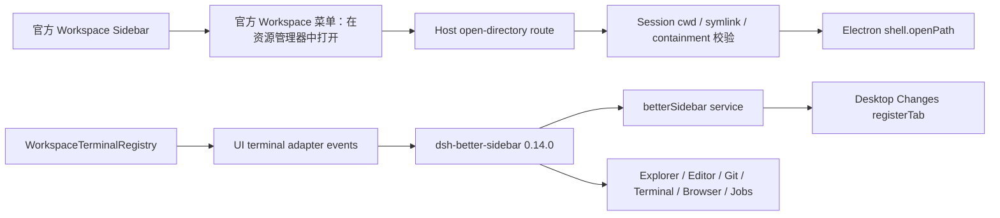

# 社区市场与右侧工作台回归修复记录

> 日期：2026-08-21
> 修复版本：`v2.0.6`
> 基线：`sync/upstream-composed`，rc8，`723c9c3bdf`
> 范围：不修改 `deepseek-harness/`；桌面行为由 `dsh-plugin-desktop/`、产品 profile 和受控 Yarn patch 负责。

## 结论

上一版 `b4ebafc96c` 的右侧 Workbench 是 Desktop 自写的简化 UI，不是 `omdsh-dev/DSH-better-sidebar`。它引入了自己的固定面板和 `#root` 宽度预留，导致窄窗口下上游 modal/点击层出现回归风险；它现在已删除。

最终修复采用上游工作台作为产品主体：固定 `dsh-better-sidebar@0.14.0`，恢复其官方 bundle/profile 挂载和 `betterSidebar.registerTab` 服务。上游包是 MIT，当前包声明与 DSH `0.1.0-rc.8` peer contract 对齐，包含 Explorer、Editor、Git、Terminal、Browser、Subagent、Jobs 和 Settings 等完整能力。

Desktop 自己只保留三类薄适配：

- Host 的 Session/Workspace binding、Changes/Review、Activity Ledger、Terminal projection 和 Worktree routes；
- 将已有 `WorkspaceChangesTab` 注册到上游 Better Sidebar；
- 左侧官方 Workspace project row 的右键“打开目录”，以及 Better Sidebar Explorer 目录的右键“打开目录”，两者都通过 Host 路径校验后调用 Electron 默认文件管理器。

## 发生了什么

### 不是整个侧栏被重写

左侧会话/Workspace 栏一直来自官方 `@deepseek-ai/dsh-client-ui-sidebar` 与 `@deepseek-ai/dsh-client-ui-workspace`。本轮通过受控 Yarn patch 给官方 Workspace project row 增加稳定路径标记，并把“在资源管理器中打开”加入官方 Workspace 菜单；没有修改上游源码，也没有再渲染 Desktop 自己的浮层。

右侧完整工作台来自 `dsh-better-sidebar`。上游包公开 `betterSidebar` service，外部插件通过 `registerTab` / `registerFileViewer` 接入。它的 0.14.0 package manifest 声明 `@deepseek-ai/*` rc8 peer，bundle patch 负责插入 `better-sidebar` Loader row。

上一轮的 `DesktopWorkbench.tsx` 是错误的平行 presentation。它只实现 Changes、Terminal projection、Worktree 三个 tab，无法替代上游完整侧栏；同时固定 `#root` 预留会把官方对话/弹窗布局挤到错误位置。修复提交删除该组件、样式、localStorage 状态和测试。

### 之前开发的能力是否被删除

| 能力 | 当前状态 | 说明 |
| --- | --- | --- |
| Session/Workspace binding | 保留 | `WorkspaceWorkbenchService` 仍是 Host 权威绑定 |
| Changes/Review | 保留并重新接线 | `WorkspaceChangesTab` 通过上游 `betterSidebar.registerTab` 出现在新建 Tab 菜单 |
| Activity Ledger | 保留 | Session event → Activity projection 仍在 `workspace-workbench.ts` |
| UI/Agent Terminal identity | 保留 | `WorkspaceTerminalRegistry` 仍在；Better Sidebar UI terminal adapter 重新投影 attached/output/input/resize/exit/close/disconnect |
| Worktree/Environment | 保留 | inspect/create/remove route 仍由 Host ownership、dirty 和 managed-root 校验 |
| 左侧目录右键打开 | 恢复 | Workspace row 有稳定 path 标记，Desktop overlay 只渲染一个菜单 |
| Better Sidebar Explorer 目录右键打开 | 恢复 | 0.14.0 Yarn patch 增加 `open-directory` 菜单项并调用 Desktop Host route |
| Browser webview 特化 | 未恢复为 `<webview>` | 上游 0.14 使用 iframe sandbox、probe、外部打开和临时解锁；旧 `<webview>` patch 被视为安全模型差异，未盲目重引 |

因此不是“两天工作全部删除”，而是错误删除了旧 UI provider 后，又写了一个功能缩水的替代 UI。现在数据层保留，上游 presentation 恢复，Desktop 只做薄接线。

## 修复路径



## Evidence、Finding 与 Path

### Evidence

| ID | 证据 | 重现 | 结果 |
| --- | --- | --- | --- |
| E-001 | 上游 package manifest 与公开 contract | 浏览 [DSH-better-sidebar package.json](https://github.com/omdsh-dev/DSH-better-sidebar/blob/main/package.json) | MIT；当前 main 0.14.1，npm 固定 0.14.0；peer 为 DSH rc8 |
| E-002 | 产品依赖/profile | `rg -n "dsh-better-sidebar|DEFAULT_DESKTOP_PLUGIN_BUNDLES|betterSidebar" dsh-plugin-desktop package.json src` | package 固定 0.14.0，profile 自动保留 `better-sidebar` bundle |
| E-003 | Desktop client 接线 | `rg -n "registerTab|betterSidebar" dsh-plugin-desktop/src/client` | Changes 注册到上游 service；无 `DesktopWorkbench`、无 root padding、无自写目录浮层 |
| E-004 | 安全目录路由 | `corepack yarn workspace dsh-plugin-desktop vitest run tests/open-directory.spec.ts` | 只允许绑定 Session checkout 内的真实目录 |
| E-005 | 针对性测试 | `corepack yarn workspace dsh-plugin-desktop vitest run tests/open-directory.spec.ts tests/package.spec.ts tests/profile.spec.ts --maxWorkers=1` | 3 files，47 tests passed；完整 targeted set 仍需 packaged smoke 覆盖 |
| E-006 | packaged upstream smoke | Playwright CDP 连接新 unpacked `DSH Desktop.exe` | `data-dsh-panel-host=1`，自写 Workbench=0，root padding=0px；官方 Files 树显示 `DHS` |
| E-007 | 左侧交互 | 同一 smoke 中点击官方 `button[class*="newSession"]` | 命中真实 `SPAN`/button，点击成功；不是被透明 overlay 拦截 |
| E-008 | 左侧目录右键 | packaged Electron smoke 右键官方 Workspace row | 官方菜单显示“在资源管理器中打开”，请求走 Desktop native route，不进入 Files tab；route 200，无 `is a directory` 错误 |
| E-009 | 上游 Tab 注册 | 点击上游侧栏新建 Tab 菜单 | 菜单包含 `Changes` |
| E-010 | patched upstream bundle | `rg -n "open-directory|workspaceTerminal|terminal process exited" node_modules/dsh-better-sidebar/lib` | Explorer open-directory 和 UI terminal adapter 已进入实际 client/host bundle |
| E-011 | Windows x64 release artifact | `corepack yarn dist:win` + `verify-win-installer.ts` | `DSH-Desktop-2.0.6-x64-Setup.exe`，253,628,327 bytes，SHA-256 `62CE5F6E685E4FCD627B26B0C201FD2A637CC907C62E5DC17B16A7B9EDC9296D`；verifier passed |

### Findings

| ID | Finding | 状态 |
| --- | --- | --- |
| F-001 | 自写简化 Workbench 不等价于上游完整侧栏，并造成窄窗口布局风险 | 已修复：删除并恢复上游包 |
| F-002 | rc8 profile 把维护中的 Better Sidebar 错误列入 obsolete，导致右侧入口消失 | 已修复：固定 0.14.0 并自动回填 bundle |
| F-003 | 既有 Host Workbench 能力与侧栏 UI 断开 | 已修复：Changes registerTab、Terminal adapter 重新接线 |
| F-004 | 左侧 Workspace 与 Better Sidebar Explorer 缺少安全的系统目录打开动作 | 已修复：两条 UI 路径都经 Host containment 校验 |
| F-005 | 旧 webview 特化 patch 与上游 iframe sandbox 语义不同 | 接受差异：保留上游安全 iframe，后续单独做 webview 安全 RFC |

### Call paths

#### P-001 上游右侧工作台

1. Desktop profile 将 `dsh-better-sidebar` 作为固定 bundle；其 `cordis.patch.yml` 插入 `better-sidebar` row，证据 E-001、E-002。
2. 上游 client 发布 `betterSidebar` service；Desktop client 等待该 service 并注册 `desktop:changes`，证据 E-003、E-009。
3. 上游 portal 渲染 Files/Git/Terminal/Browser/Jobs 等完整 surface，证据 E-006。

#### P-002 目录打开

1. 官方 Workspace row 和上游 Explorer directory row 提供路径；前者由 Workspace patch 标记并进入官方 actions menu，后者由上游 FileTree context menu 提供，证据 E-006、E-008、E-010。
2. Explorer 请求带 `sessionId`；Workspace 根目录请求按已绑定 checkout 做最长根匹配。两条路径都拒绝跨 cwd、父级逃逸、符号链接和非目录，证据 E-004。
3. Electron Host 调用 `shell.openPath`，Renderer 不执行 shell 命令，证据 E-004、E-008。

#### P-003 终端投影

1. Better Sidebar UI PTY attach 到 `WorkspaceTerminalRegistry`，记录 attached/output/input/resized/exited/closed/disconnected。
2. Session event 中的 Agent terminal tool call/result 继续由 Desktop Host registry 投影。
3. 侧栏退出后关闭 socket，reconnect grace 允许 `PtyManager` 替换 exited handle，证据 E-005、E-010。

## 本轮代码变更

- `dsh-plugin-desktop/package.json`：固定 `dsh-better-sidebar@0.14.0`、`cordis@4.0.0-rc.8`、`react-dom@18.3.1`。
- `dsh-plugin-desktop/src/profile.ts`：移除 Better Sidebar obsolete 规则，自动把维护中的 bundle 放入 desktop profile。
- `dsh-plugin-desktop/src/client/index.ts`：删除自写 Workbench 注册，改为 upstream `betterSidebar.registerTab`；删除 Desktop 自写 Workspace 浮层。
- `dsh-plugin-desktop/src/open-directory.ts`：新增 Session containment 保护的 native directory route。
- `dsh-plugin-desktop/src/workspace-workbench.ts`、`runtime.ts`、`electron-runtime.ts`：挂载 route 并提供 Electron `openDirectory` 能力。
- `.yarn/patches/dsh-better-sidebar-npm-0.14.0-2667792587.patch`：迁移 Explorer 目录打开和 UI terminal adapter 到上游 0.14.0 compiled/source bundle。
- `.yarn/patches/@deepseek-ai-dsh-client-ui-workspace-npm-0.1.0-rc.8-1e7b7c614c.patch`：把系统 Explorer 动作放进官方 Workspace 菜单，并保留 Workspace drop target 标记。
- `dsh-plugin-desktop/scripts/package-dir.mjs`：与正式 Windows 打包一致，关闭本机 npmRebuild，避免依赖本机 Spectre MSBuild 库。
- 删除 `dsh-plugin-desktop/src/client/DesktopWorkbench.tsx` 及其测试，删除上一版误导性的 Workbench 截图证据。

## 验证与发布

已通过：

```powershell
corepack yarn install --immutable
corepack yarn workspace dsh-plugin-desktop typecheck
corepack yarn workspace dsh-plugin-desktop vitest run tests/open-directory.spec.ts tests/package.spec.ts tests/profile.spec.ts --maxWorkers=1
corepack yarn package:dir
```

正式 gate、NSIS 构建和安装包 verifier 已完成：

- 安装包：`dsh-plugin-desktop/dist/DSH-Desktop-2.0.6-x64-Setup.exe`
- 大小：253,628,327 bytes
- SHA-256：`62CE5F6E685E4FCD627B26B0C201FD2A637CC907C62E5DC17B16A7B9EDC9296D`
- `verify-win-installer.ts`：通过
- GitHub Release：[DSH Desktop v2.0.6](https://github.com/rw0104/DSH-desktop/releases/tag/v2.0.6)

## 非目标与后续

- 不复制 `omdsh-dev/DSH-better-sidebar` 的源代码到本仓库；通过固定 npm 包和 Yarn patch 维持可审计的薄适配。
- 不修改 pinned `deepseek-harness/` 子模块。
- 不把上游 iframe sandbox 擅自替换成 Electron `<webview>`；如需恢复旧 webview 能力，必须单独审查 navigation、partition、sandbox、will-attach-webview 和外链策略。
- Artifacts/Tasks/Context Inspector 仍由上游侧栏或后续 Desktop Host 计划管理，不在本次宣称新建平行 UI。
