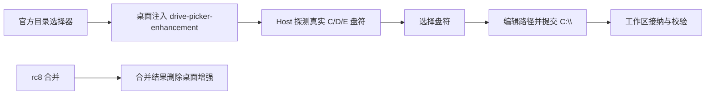

# DSH Desktop 上游迁移与工作区目录选择器恢复报告

更新时间：2026-08-22

## 摘要

本报告记录本轮分析、证据、迁移目标和发布门禁。用户要求先完成官方上游升级、恢复 Windows 工作区目录选择器并发布新安装包；产物复制和视觉模型能力误判留到安装包完成后处理。

## 结论与范围

- 当前产品不是官方 Harness 最新源码：本地固定 `dsh-v0.1.0-rc.8`，官方已发布 `dsh-v0.1.1-rc.2`。
- “文件夹选择工具”不是侧栏右键目录功能，而是“选择工作区目录”弹窗里的 Windows 实际盘符下拉。
- 该功能在历史提交中存在，并在 rc8 合并结果中被删除；本轮只恢复盘符选择器，不恢复已被替换的自写右键浮层。
- 产物复制和视觉模型警告是独立问题，不进入本轮安装包范围。

## Evidence → Finding → Path

| Evidence | Finding | Path |
| --- | --- | --- |
| `0f98feed34` | 首次加入 Windows 实际盘符检测和盘符选择下拉 | `dsh-plugin-desktop/src/client/drive-picker-enhancement.ts`（历史版本） |
| `2f58276e4f`、真实 Electron 截图 | 修复盘符异步清空导致的 `:\`，选择 C 后得到 `C:\` | `docs/evidence/electron/directory-picker-1.0.1-selected-c.png`（历史证据） |
| merge `7d4dd6a6e6` | rc8 桌面线合并结果删除盘符增强文件 | `git show -m 7d4dd6a6e6 -- dsh-plugin-desktop/src/client/drive-picker-enhancement.ts` |
| merge `3f5ae5e105` | 后续合并继续携带删除结果 | 同上路径的完整历史 |
| 官方 Harness remote | 最新目标为 `dsh-v0.1.1-rc.2` / `b150a551…` | `docs/upstream-sync.md` |
| npm registry | `@deepseek-ai/dsh@0.1.1-rc.2`、`dsh-better-sidebar@0.15.1` | `docs/upstream-sync.md` |
| 当前聊天 UI 源码 | 产物只显示 basename，完整路径在 title，没有复制路径/内容动作 | `@deepseek-ai/dsh-client-ui-deliverables` |
| Host image admission | 图片发送前按 `inputModalities` 拒绝未声明 image 的模型 | `deepseek-harness/packages/host/apiproxy/src/api-proxy.ts` |

## 历史功能链路



历史验证在本机确认过真实盘符为 `C:`、`D:`、`E:`；修复后的弹窗选择 C 会把输入框设置为 `C:\`，根目录列表正常，错误为空。

## 上游审计结果

| 组件 | 当前本地 | 目标上游 | 迁移策略 |
| --- | --- | --- | --- |
| DeepSeek Harness | `dsh-v0.1.0-rc.8` / `141eb6f…` | `dsh-v0.1.1-rc.2` / `b150a551…` | 更新 submodule gitlink 与整个 `@deepseek-ai/dsh-*` family |
| Better Sidebar | `0.14.0` + patch | `0.15.1` | 采用已审计 patch，验证 registerTab、Terminal、Explorer 和布局入口 |
| Desktop reference | 本 fork `v2.0.7` | 参考主线 `6201080…`，根版本 `2.0.2` | 只比较 Electron/构建行为，不引入为依赖 |

本次 remote 与 registry 审计使用：

```powershell
git -c http.proxy=http://127.0.0.1:10808 ls-remote --heads --tags https://github.com/deepseek-ai/deepseek-harness.git
git -c http.proxy=http://127.0.0.1:10808 ls-remote --heads --tags https://github.com/omdsh-dev/DSH-better-sidebar.git
git -c http.proxy=http://127.0.0.1:10808 ls-remote --heads --tags https://github.com/anywhere-labs/deepseek-harness-desktop.git
$env:HTTPS_PROXY='http://127.0.0.1:10808'; npm view @deepseek-ai/dsh version dist-tags --json
$env:HTTPS_PROXY='http://127.0.0.1:10808'; npm view dsh-better-sidebar version dist-tags --json
```

## 本轮发布门禁

1. 更新上游 pin，并将该 gitlink 放入独立提交。
2. 使用 rc2 package family 与官方参考 patch 更新根 Yarn resolutions/lockfile。
3. 选择性恢复盘符增强及其测试，不编辑 `deepseek-harness/` 内文件。
4. 运行 immutable install、build、typecheck、unit tests、`corepack yarn check`。
5. 运行 Loader/Profile/closure、Windows packaged smoke 和 installer verifier。
6. 记录版本、提交、安装包 SHA-256 和回滚点。

## 明确延期

- 产物行增加“复制绝对路径”和“复制文本内容”：需要新的 Host 解析/读取契约、containment 校验、文本大小限制和 UI 测试。
- 视觉模型误警告：需要在模型设置入口补齐 `input`/`inputModalities` 声明和刷新链路，不能简单放宽 Host 门禁。

这两个问题在新版安装包构建完成后单独开发，避免与本轮上游迁移混在同一个发布变量中。
