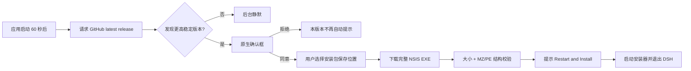
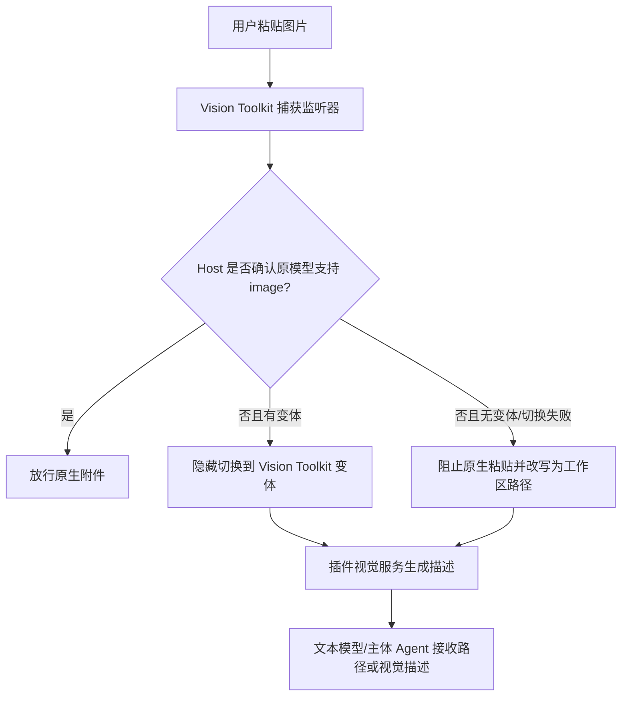

# DSH Desktop v2.0.8 更新、启动外链与视觉输入诊断报告

更新时间：2026-08-24

## 摘要与决策

本报告延续 [`2026-08-22_analysis-dsh-desktop-report.md`](2026-08-22_analysis-dsh-desktop-report.md) 中明确延期的“产物复制”和“视觉模型能力误判”，并分析 v2.0.8 实际更新体验、启动时打开网页、第三方视觉工具接管图片输入及配置 Key 后仍报运行环境错误的问题。

结论如下：

| 事项 | 当前事实 | 决策 |
| --- | --- | --- |
| 更新 v2.0.8 | v2.0.8 自身已包含应用内检查、完整安装包下载和启动安装器；不是只能打开网页下载 | 保留应用内更新，改成成熟的后台下载/重启安装体验；网页只作为手动兜底 |
| 更新安全 | 下载只校验大小及 MZ/PE 结构，当前 Windows 发布脚本生成 unsigned 安装器 | 下一版本发布前补 SHA-256 清单校验和 Authenticode；未完成时不得宣传为安全自动更新 |
| 启动打开网页 | Web 基座明确设置 `openBrowser: false`；更新器不会主动打开网页；Renderer 的任意 HTTP(S) 新窗口请求会转交系统浏览器，成功路径不记录来源 | 将通用 `window.open` 外链改成显式、可归因、用户触发的窄桥接；当前具体网页因缺 URL 证据不能武断归因 |
| 视觉运行环境 | v2.0.8 的 `app.asar` 缺少插件清单要求的 `CHANGELOG.md`；运行日志在每次启动稳定复现 | 这是确定的打包缺件，不是 API Key 问题；当前成品中的视觉运行时判定为不可用 |
| 视觉输入接管 | 插件在捕获阶段拦截图片粘贴，并可改写为路径或隐藏切换到变体模型；同时它是默认且不可禁用的产品 Bundle | 这不是 Agent 权限提升，但确实拥有原生附件之前的输入控制权；立即取消默认不可禁用地位 |
| 是否保留视觉工具 | npm `0.1.38` 源包内容完整、功能有价值，但当前成品、默认外发策略和禁用治理不合格 | 仅以可选、可禁用、显式同意外发的增强插件保留；若打包烟测和输入优先级矩阵不过，下一版本移除依赖 |
| 视觉模型误判 | 适配器支持 `inputModalities`，但模型设置 UI 不提供编辑项，模型发现和选择目录也不携带该能力 | 不取消 Host/Adapter 安全门禁；补齐设置、元数据投影、刷新和切换链路 |
| 产物复制 | 当前只显示 basename，完整路径仅在 `title`，点击执行打开文件 | 增加 Host 受控的“复制绝对路径/复制文本内容”，包含范围、大小、文本和链接边界校验 |

对应执行顺序、文件边界和验收矩阵见 [`2026-08-24_v2.0.9-remediation-task-plan.md`](2026-08-24_v2.0.9-remediation-task-plan.md)。

## 调查范围与限制

本轮是诊断和规划，不直接修改产品行为，也没有启动新的图形应用实例。调查覆盖：

- `v2.0.8` 标签和当前 Windows 安装产物；
- Desktop 更新检查、下载、安装器交接和外链处理；
- `@anionex/dsh-vision-toolkit@0.1.38` 的配置、打包清单、运行时验证和图片粘贴链路；
- 官方 Harness 的模型设置、能力元数据、模型目录、切换和图片发送门禁；
- 官方桌面软件和 Electron 更新文档；
- 既有产物行实现及其测试边界。

“每次启动打开的具体网页”没有 URL、浏览器截图或带来源的运行日志。当前证据足以排除 Web 基座和更新器主动开网页，但不足以把外链归到某一个 Renderer 插件。报告不会把未验证推断写成根因。

## v2.0.8 当前怎样更新

### 实际链路

v2.0.8 包含一条“半自动完整安装包更新”链路：



关键实现：

- `dsh-plugin-desktop/src/updates.ts:36-38`：打包应用启动 60 秒后检查，以后每 6 小时检查一次；
- `dsh-plugin-desktop/src/update-checker.ts:4`：版本源是产品自己的 GitHub `releases/latest`；
- `dsh-plugin-desktop/src/update-download.ts:13-16`：从固定 GitHub Release 路径下载，最大 1 GiB；
- `dsh-plugin-desktop/src/electron-runtime.ts:608`：每次下载先弹保存位置；
- `dsh-plugin-desktop/src/electron-runtime.ts:588,660`：下载后由用户确认，再启动安装器并退出；
- `dsh-plugin-desktop/package.json:322`：`differentialPackage: false`，所以是完整安装包而不是差分包。

因此要区分两个方向：

- **从不含这条更新链的旧版本升级到 v2.0.8**：仍可能需要在发布网页手动下载一次；
- **从 v2.0.8 升级到后续版本**：产品已经能在应用内检测、下载完整安装包并启动安装，不应再要求用户手动浏览发布页。

“关于”页的“查看版本与更新说明”确实会打开发布网页，但它与“检查更新”是两个独立按钮，见 `dsh-plugin-desktop/src/client/about-section.tsx:50-53`。

### 与常见软件的比较

| 产品/框架 | 官方行为 | 对 DSH 的启示 |
| --- | --- | --- |
| [VS Code for Windows](https://code.visualstudio.com/docs/setup/windows) | 推荐 User setup，因为无需提权且后台更新更顺；应用提示后接受更新 | DSH 当前也是 per-user NSIS，适合保留应用内更新，不需要网页跳转 |
| [Slack Desktop](https://slack.com/help/articles/360048367814-Update-the-Slack-desktop-app) | 应用内检查，下载后显示 Restart to Apply Update | 使用“已下载，重启安装”状态，而不是让用户管理安装包文件 |
| [Google Chrome](https://support.google.com/chrome/answer/95414?hl=en-ME) | 后台更新，重启时应用；用户可以稍后重启 | 下载和应用分离，避免打断工作；重启决定留给用户 |
| [Electron updating applications](https://www.electronjs.org/docs/latest/tutorial/updates) | 后台检查/下载，完成后提示重启；支持更新元数据 | 更新状态应是产品能力，不是一个外链按钮 |
| [electron-builder auto update](https://www.electron.build/docs/features/auto-update/) | Windows NSIS 支持 `latest.yml`、校验和、进度和重启安装 | 当前构建已生成 `latest.yml`，但自写下载器没有消费其校验信息 |

推荐目标是：后台检查；在应用私有更新目录下载；展示进度；下载完成后让用户选择“现在重启”或“退出时安装”；失败可见且可重试；发布网页仅为企业限制、网络失败或旧版本的兜底。

### 当前更新安全缺口

`downloadDesktopUpdate()` 做了合理的路径、临时文件、大小上限、取消和 PE 结构检查，但 `validateArtifact()` 只确认文件像一个 PE 可执行文件。它没有：

- 比对发布清单中的 SHA-256；
- 验证 Windows Authenticode 发布者；
- 验证下载资产与 GitHub Release 元数据的一致性；
- 将下载/校验/启动失败反馈给用户；`update-lifecycle.ts` 当前会静默吞掉这些失败。

此外，`dsh-plugin-desktop/scripts/package-win.ts:1,130` 明确将当前产物描述为 unsigned，签名是另一个尚未完成的发布步骤。对 v2.0.8 Release 安装器和本机已安装 `DSH Desktop.exe` 执行 `Get-AuthenticodeSignature`，两者状态均为 `NotSigned`。Electron Builder 的 [Windows 更新签名验证](https://www.electron.build/docs/win/) 默认会比较下载安装器的签名发布者，但前提是安装器已经 Authenticode 签名并由 `electron-updater` 接管。

这不代表 GitHub 下载已经遭到篡改；它表示当前更新链没有建立成熟软件应有的“发布者到安装器”密码学证明。该项应作为下一次自动更新发布的阻断条件。

## 启动时为什么会打开网页

### 已排除的路径

仓库中的 Web 基座配置为 `openBrowser: false`（`dsh-plugin-desktop/node_modules/@deepseek-ai/dsh-web-app/cordis.patch.yml:141`），Desktop 还把 `printUrl` 关闭。主窗口本身是 Electron `BrowserWindow` 加载回环 Web UI，这是产品架构；它不应启动系统浏览器。

更新链也没有调用 `shell.openExternal()`。它使用原生对话框、`net.fetch()`、文件选择器和 `spawn(installer)`。

所以：

- 如果用户说的“网页”是 DSH 窗口内的 `127.0.0.1` Web UI，这是 Electron 承载方式，不是额外网页；
- 如果是 Chrome/Edge 等系统浏览器的新标签页，则不是 Web 基座或更新检查直接打开的。

### 仍然存在的通用外链入口

`dsh-plugin-desktop/src/electron-shell-generation.ts:147-155` 为所有 Renderer 新窗口请求安装了统一处理器。HTTP、HTTPS 和 mailto 目标都会交给 `shell.openExternal()`，然后 Electron 内部窗口拒绝创建。

当前已知会产生这类请求的 UI 包括：

- Desktop “仓库”和“查看版本与更新说明”；
- Vision Toolkit 的 AIHubMix 图文教程链接。

这些源码都是点击型链接，没有启动时主动调用。问题在于统一处理器：

- 不记录成功打开的目标或发起来源；
- 不区分第一方和第三方插件；
- 不要求调用方走一个显式、可审计的产品桥接；
- 因而一旦某个插件在挂载时发出 `window.open()`，主进程会照样打开系统浏览器，事后没有归因证据。

### 处理建议

1. 默认拒绝任意 Renderer 的通用新窗口请求，不再自动转交系统浏览器。
2. 为第一方“仓库/发布说明”增加 preload/IPC 的显式 `openExternal` 动作，只接受固定 origin 和固定路径类型。
3. 第三方链接走带产品确认的外链动作，确认框展示域名；不允许插件挂载时自动打开。
4. 记录脱敏后的 `target origin + path class + initiator plugin/first-party action`，不记录查询参数、token 或页面内容。
5. 增加“应用启动和插件挂载完成后 `shell.openExternal` 调用数为 0”的回归测试。

若要给当前现象做最终归因，仍需一次最小证据：系统浏览器实际打开的 URL（可去掉查询参数）及启动时间。任务计划不会因此停住，因为外链边界本身已经需要收紧。

## 第三方视觉工具为什么接管图片

### 它不是更高权限的 Agent

Vision Toolkit 没有获得比主体 Agent 更高的推理权限，也不能越过 Host 的文件和模型门禁。它获得的是两个更靠前的组合位置：

1. **产品 Profile 权限**：`dsh-plugin-desktop/src/profile.ts:52-55` 把它加入每个 Desktop Profile 的默认 Bundle；
2. **输入事件优先级**：`paste-images.tsx` 在 document 捕获阶段监听图片粘贴，对需要接管的粘贴调用 `preventDefault()`、`stopPropagation()` 和 `stopImmediatePropagation()`。

这发生在消息和主体 Agent 收到图片之前。因此从用户体验看，它可以接管图片；从系统权限看，它是在重写输入，而不是 Agent 层级更高。

当前默认配置还启用模型变体、自动切换并隐藏变体身份（`config.ts:136-140`）。典型链路是：



如果主模型实际支持图片，但配置没有声明 `image`，插件拿到的仍是“文本模型”判定，于是错误进入 E/F。这与用户观察一致。

### 用户为什么无法禁用

`dsh-plugin-desktop/src/desktop-plugins.ts:38-45` 把 Vision Toolkit 列入 `IMMUTABLE_BUNDLES`。即使用户的 `plugin-management/state.json` 已记录禁用，`activeDesktopProfileLayers()` 也只会过滤 mutable Bundle，所以它仍会加载。

本机状态确实同时记录了禁用 Vision Toolkit 和 Better Sidebar，但 2026-08-24 启动日志仍加载并报告 Vision Toolkit 运行时错误。这是“用户意图被产品不可变策略覆盖”的直接证据。

第三方视觉增强不应与 Web 基座、Desktop 主插件一样不可禁用。取消 immutable 是必须项。

## 配了 Key 为什么仍提示运行环境问题

### 根因是成品缺件

用户截图的原始错误为：

```text
packaged upstream file is missing: CHANGELOG.md
```

截图 SHA-256 为 `72F8DCF8A3BB64760114CEE1B2120C0DF7763E064E5C0D3FE24C8FBDAD7D2444`。同一错误在本机 `dsh-2026-08-22.log`、`dsh-2026-08-23.log` 和 `dsh-2026-08-24.log` 每次启动稳定出现。

证据链：

1. npm 工作区中的 `@anionex/dsh-vision-toolkit@0.1.38` 源包实际包含 `vendor/agent-vision-toolkit/CHANGELOG.md`；
2. `UPSTREAM_MANIFEST.json` 把它列为必须存在且必须匹配 SHA-256 的文件；
3. `runtime-install.ts:230-249` 在准备 Python/调用在线服务前先验证所有清单项；
4. v2.0.8 的 `dist/win-unpacked/resources/app.asar` 中清单仍在，但 `CHANGELOG.md` 不在；
5. 因而 `manager.initialize()` 在任何 API Key 或模型测试之前失败，视觉 Skill 和 Agent tools 不会注册。

可重复检查成品内容：

```powershell
Set-Location D:\Demo\DHS\dsh-plugin-desktop
corepack yarn node -e "const a=require('@electron/asar');const p='dist/win-unpacked/resources/app.asar';const e=a.listPackage(p);console.log(e.filter(x=>x.includes('dsh-vision-toolkit')&&(x.includes('CHANGELOG')||x.includes('UPSTREAM_MANIFEST'))).join('\n'))"
```

预期的失败信号是能看到 `UPSTREAM_MANIFEST.json`，看不到 `vendor/agent-vision-toolkit/CHANGELOG.md`。

### 为什么发布门禁没有发现

Electron Builder 会对依赖进行生产文件过滤。Vision Toolkit 的 npm `files` 包含整个 `vendor`，但 Desktop 成品过滤掉了名为 `CHANGELOG.md` 的文档文件，同时保留了依赖它的清单。

`scripts/verify-packaged-runtime.ts` 当前只检查一组 Desktop/DSH 关键入口和包导出能否解析，没有执行每个产品 Bundle 的自有完整性验证。聚焦测试的 7 个测试文件、187 项测试全部通过，成品仍缺文件，证明测试面与故障面没有相交。

API Key 只影响在线视觉服务认证。它不能修复本地 `app.asar` 缺件，所以“已保存 Key”与“运行环境尚未就绪”可以同时出现。

## 视觉工具保留还是移除

截至 2026-08-24，npm 最新版仍是 [`@anionex/dsh-vision-toolkit@0.1.38`](https://www.npmjs.com/package/%40anionex/dsh-vision-toolkit)。源包提供 OCR、grounding、裁剪、像素对比等有价值能力，源内容本身包含缺失文件。因此不能仅凭这次 Desktop 打包错误判定上游功能完全不可用。

但当前成品有三个独立的“不合格”：

- 运行时确定不可用；
- 默认、隐藏地接管图片输入；
- 用户不能禁用，且默认服务会把在线识图图片发送到外部视觉端点。

推荐采用有条件保留，而不是继续默认强制启用：

- 从 `DEFAULT_DESKTOP_PLUGIN_BUNDLES` 和 `IMMUTABLE_BUNDLES` 移除；
- 原生视觉模型始终优先走官方 Harness 附件链，不调用第三方视觉服务；
- 文本模型的视觉增强由用户显式安装/启用，并在首次外发前展示目标域名和隐私说明；
- 默认 `autoSwitch` 和 hidden takeover 在 Desktop 产品层关闭；
- 打包后必须运行插件自己的 `verifyBundledUpstream()` 和真实 multimodal 假服务烟测；
- 若这些门禁在下一版候选包中不能全部通过，移除 `@anionex/dsh-vision-toolkit` 产品依赖和设置入口，避免保留一个坏的、不可关闭的表面。

## 视觉模型能力为什么会误判

### 能力声明已有，设置入口缺失

官方 Harness 的底层模型契约支持 `inputModalities: ['text', 'image']`：

- `llm-deepseek/src/index.ts:153` 的 schema 支持并默认 `['text']`；
- `llm-deepseek/src/adapter.ts:391-397` 对未进入目录的模型安全地按纯文本处理；
- `llm-deepseek/src/adapter.ts:446-451` 在真正发送前再次拒绝未声明 image 的模型；
- `host/apiproxy/src/api-proxy.ts:2388` 在持久化图片前执行 Host 门禁。

问题在上层：

- `DeepSeekModelsEditor` 可编辑字段只有 `id/name/contextWindow/maxTokens`；
- `ModelListEditor` 的模型发现采用函数只保留 id、name 和容量；
- `DiscoveredModelView` 不携带输入模态；
- `ModelCatalogModel` 只投影 reasoning，不投影 `inputModalities`；
- 所以用户无法在 UI 中声明视觉能力，模型选择器也无法展示或刷新该能力。

如果只删除警告或放宽门禁，真正的纯文本模型会收到图片并在 Provider I/O 阶段失败，甚至可能把已经持久化的会话留在无法继续的状态。正确修复是让可信能力元数据贯穿设置、Host、客户端目录和切换流程，而不是取消安全检查。

### 正确的能力来源和状态

建议使用三态，不用模型名称猜测：

| 状态 | 含义 | 图片行为 |
| --- | --- | --- |
| `image` 已声明 | 用户配置、官方内置目录或可信 Provider 元数据明确支持 | 允许原生附件；适配器发送前仍复核 |
| `text` 已声明 | 明确不支持图片 | Host 在持久化前拒绝；可提示启用可选视觉增强 |
| `unknown` | Provider 没有可靠能力信息 | 默认不宣称支持；UI 引导用户确认/配置，不能按模型名自动放行 |

设置提交后已有两个可利用的刷新事件：`settings/document-updated` 和 `llm/adapters-updated`，`ModelDirectoryResolver` 会重新加载打开过的会话目录。缺的是能力字段本身，以及“设置提交完成后当前选中模型能力已刷新”的测试。

由于 `deepseek-harness/` 是只读固定子模块，这一修复必须先进入官方上游并发布兼容 package family；Desktop 功能分支不得直接编辑子模块文件。临时的 Desktop 高级模式扩展不能替代兼容模式的官方修复。

## 对话产物复制能力

当前 `ui-deliverables` 的 `ProducedFiles`：

- 芯片文本是 `basename(path)`；
- 完整路径只写入 HTML `title`；
- 点击调用 Host `openFile(path)`；
- 没有剪贴板或读取文件内容的 Host 契约。

“复制绝对路径”和“复制文本内容”不能只在 React 中直接读取本地文件。必须经过 Host/主进程边界，并至少执行：

| 边界 | 首版规则 |
| --- | --- |
| 授权对象 | 只接受该会话已匹配为产物的路径，不接受任意 Renderer 路径 |
| 路径范围 | 相对路径以会话 workspace/cwd 解析；`realpath` 后必须位于允许根中；拒绝越界、NUL、目录、设备、符号链接和 junction/reparse 越界 |
| 文件类型 | 必须是 regular file；内容复制用 UTF-8 fatal decode 并拒绝 NUL/二进制 |
| 大小 | 首版建议 1 MiB；先 stat，再做 limit+1 的有界读取，避免竞态和内存放大 |
| 绝对路径复制 | 复制 Host 规范化后的绝对路径，而不是 Renderer 自己拼接 cwd |
| 内容复制 | 只把通过校验的文本交给 Electron clipboard；错误只显示稳定的产品文案 |
| 测试 | Windows 盘符、UNC 拒绝/允许策略、`..`、大小边界、UTF-8 非法、NUL、二进制、链接和文件替换竞态 |

具体任务拆分见任务规划的 ART 工作包。

## Evidence → Finding → Path

### Evidence

| ID | 不可变观察 | 来源/复现 |
| --- | --- | --- |
| E-001 | HEAD 为 `e419b104bf`，标签 `v2.0.8`；调查开始时工作区无改动 | `git status --short --branch; git tag --points-at HEAD; git log -1` |
| E-002 | 更新器在应用内检查、下载完整安装器并启动，不依赖打开发布网页 | `updates.ts`、`update-download.ts`、`electron-runtime.ts` |
| E-003 | 下载校验只有大小与文件结构；Release 安装器和已安装 EXE 的 Authenticode 状态均为 `NotSigned` | `update-download.ts:428-464`、`Get-AuthenticodeSignature`、`scripts/package-win.ts:1,130` |
| E-004 | Web 基座 `openBrowser: false`；通用 Renderer 新窗口会被转交 `shell.openExternal` | Web bundle patch、`electron-shell-generation.ts:147-155` |
| E-005 | 用户截图和 8 月 22-24 日启动日志均报告缺 `CHANGELOG.md` | 截图 SHA-256 与 `%APPDATA%/DSH Desktop/logs` |
| E-006 | 源包有 `CHANGELOG.md`，v2.0.8 `app.asar` 无该文件但保留清单 | `@electron/asar.listPackage()` 复现命令 |
| E-007 | Vision Toolkit 默认且 immutable；捕获阶段可终止原生粘贴 | `profile.ts`、`desktop-plugins.ts`、`paste-images.tsx` |
| E-008 | 本机禁用状态包含 Vision Toolkit，但启动日志仍加载它 | `plugin-management/state.json` 与 2026-08-24 日志 |
| E-009 | 模型适配器有 image 能力门禁，但设置 UI/模型目录不携带该字段 | 官方 Harness 模型设置和 API 合约 |
| E-010 | 7 个聚焦测试文件、187 项测试通过，未覆盖成品插件自检 | `corepack yarn vitest run ...`，2026-08-24 |
| E-011 | 产物行仅显示 basename、title 完整路径和打开动作 | `ui-deliverables/ProducedFiles.tsx:117-130` |

### Findings

| ID | 结论 | 严重度 | 状态 | Evidence |
| --- | --- | --- | --- | --- |
| F-001 | v2.0.8 是半自动完整安装包更新，不是网页下载器 | 信息 | validated | E-002 |
| F-002 | 更新安装器缺少密码学来源验证，错误反馈也不足 | 高 | validated | E-002, E-003 |
| F-003 | 自动开网页不来自 Web 基座或更新器；通用外链入口缺来源审计 | 中 | 部分验证 | E-004 |
| F-004 | v2.0.8 成品的 Vision Toolkit 运行时确定不可用 | 高 | validated | E-005, E-006, E-010 |
| F-005 | 第三方视觉插件拥有原生附件前的输入控制权且不可禁用 | 高 | validated | E-007, E-008 |
| F-006 | 视觉模型误判来自能力元数据配置和投影链缺口 | 高 | validated | E-009 |
| F-007 | 产物复制需要新的受控 Host 合约，不能只加前端按钮 | 中 | validated | E-011 |

### Paths

| ID | 调用/数据路径 | 结果 |
| --- | --- | --- |
| P-001 | 启动 → GitHub latest → 用户确认 → 完整 EXE → 结构校验 → 启动安装器 | 功能存在，但缺 SHA/签名和成熟 UX（F-001, F-002） |
| P-002 | Renderer 新窗口请求 → 通用 handler → HTTP(S) allowlist → 系统浏览器 | 只有触发后的目标处理，没有发起来源证明（F-003） |
| P-003 | 插件清单 → `verifyBundledUpstream` → 缺 `CHANGELOG.md` → runtime not ready → 不注册视觉 Skill/tools | Key 无法改变本地失败（F-004） |
| P-004 | 图片粘贴 → 捕获监听 → 错误的 text-only 判定 → 阻止原生附件 → 变体/路径接管 | 第三方成为图片输入前置控制面（F-005, F-006） |
| P-005 | 产物相对路径 → basename 芯片 → openFile | 缺受控绝对解析、文本读取和 clipboard 边界（F-007） |

## 验证记录

聚焦测试命令：

```powershell
Set-Location D:\Demo\DHS\dsh-plugin-desktop
corepack yarn vitest run tests/updates.spec.ts tests/update-download.spec.ts tests/profile.spec.ts tests/desktop-plugins.spec.ts tests/package.spec.ts tests/verify-packaged-runtime.spec.ts tests/electron-runtime.spec.ts
```

结果：7 个测试文件通过，187 项测试通过。该结果验证了记录中的现有更新、Profile 和 Electron 合约；它不能推翻 app.asar 缺件，因为当前门禁未执行 Vision Toolkit 自检。

调查阶段本报告只新增文档，没有修改 `deepseek-harness/`、产品源码、用户配置或已安装应用；后续实施状态见下方附录。

## 实施后状态（2026-08-24）

上面的 Evidence/Finding/Path 是本轮开始时的只读调查快照；随后按任务规划完成了 Desktop 侧修复，历史结论不应被误读为当前行为：

| 原问题 | 实施结果 | 当前边界 |
| --- | --- | --- |
| v2.0.8 更新体验 | 更新器现在从 Release 资产清单取得精确版本、文件名、大小和 SHA-256；下载到应用私有目录，校验通过后才进入重启安装 | v2.0.8 本身已经发布且缺少新逻辑时仍需一次覆盖安装；v2.0.9 正式安装器还必须由发布 CI 注入并验证 Authenticode 证书 |
| 启动自动开网页 | Web runtime 覆盖层固定 `openBrowser: false`；任意 Renderer 新窗口默认拒绝；仓库/Release Notes 只能经固定 action bridge 且记录来源 | 第三方网页不再有通用外链通道；仍需在签名候选包上完成一次零外链 packaged smoke |
| Vision Toolkit 接管图片 | 从默认 Bundle、不可变集合和直接产品依赖移除；仅当用户显式安装/启用才参与组合 | 原生 `image` 模型永远优先官方附件链，视觉插件不是主体 Agent 的更高权限；插件自身可用性不再阻断原生图片 |
| 配 Key 仍报环境错误 | v2.0.8 的缺件通过产品 Bundle manifest 自检被阻断；不再把缺件误报成 Key/网络问题 | 若用户显式安装插件，必须让其完整 manifest 通过后才显示“就绪” |
| 视觉模型误判 | 通过 Yarn patch 贯通设置 `inputModalities`、Host catalog、Adapter 目录和模型选择器，未声明 image 仍由 Host/Adapter 拒绝 | 不按模型名猜测能力，不取消安全门禁；unknown 继续按不支持图片处理 |
| 产物复制 | 新增 Host 受控的绝对路径/UTF-8 文本复制，限制会话产物、workspace 范围、1 MiB、链接/二进制/竞态 | Renderer 不能读取任意本地路径；内容不会写入网络请求或日志 |

实现提交及验证记录见 [`2026-08-24_v2.0.9-remediation-task-plan.md`](2026-08-24_v2.0.9-remediation-task-plan.md) 和 [`releases/v2.0.9.md`](releases/v2.0.9.md)。本附录不改变原始调查证据，只标注调查后的产品状态。
